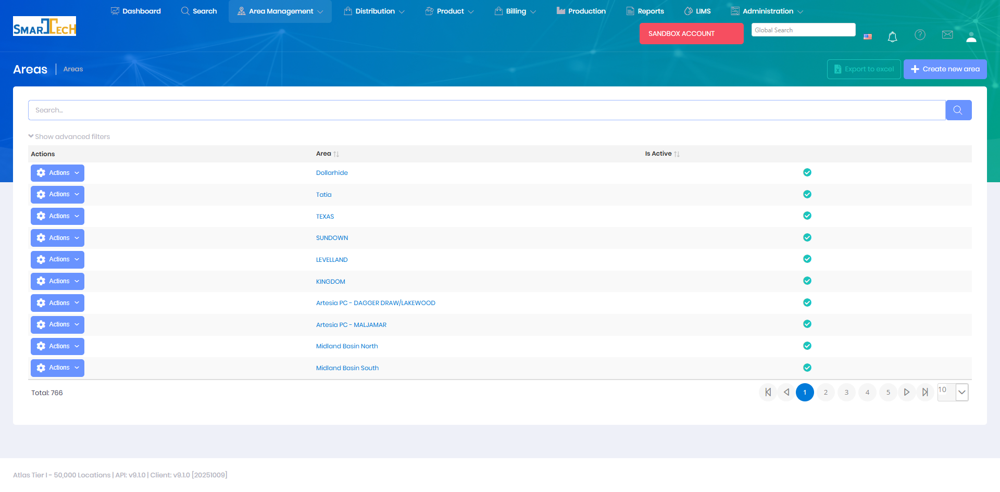

# Areas

Areas represent geographical or operational regions used to organize leases and locations. Areas provide a high-level organizational structure for grouping related properties and operations within your company.

## Overview

The Areas page manages geographical or operational regions within your organization. Areas serve as containers for leases and locations, making it easier to organize work by territory, field, or operational district.

The Areas grid displays all area records with:
* **Area** - Area name (e.g., Dollarhide, Tatia, TEXAS, SUNDOWN, LEVELLAND)
* **Is Active** - Current status indicator

The system manages 766 operational areas with support for creating, editing, exporting to Excel, and filtering. Areas are used to organize leases and locations by geographical or operational region, making it easier to manage work by territory or field.

## Key Features

* Create and manage operational areas
* Assign unique area codes and names
* Group leases within areas
* Organize personnel and resources by area
* Report and analyze by geographical region
* Configure area-specific settings

## Permissions

Access to Areas features requires the following permissions:

| Display Name | Description |
|--------------|-------------|
| Areas | View area records |
| Create Areas | Create new areas |
| Edit Areas | Modify existing areas |
| Delete Areas | Remove area records |

**Related Permissions:**

| Display Name | Description |
|--------------|-------------|
| [Leases](Leases.md) | View leases within areas |
| [Locations](Locations.md) | View locations within areas |
| [Personnel](Personnel.md) | View personnel assigned to areas |

## Related Documentation

* [Data Import - Areas](../Imports/Areas.md) - Bulk import area data
* [Leases](Leases.md) - Leases within areas
* [Locations](Locations.md) - Individual locations within areas

