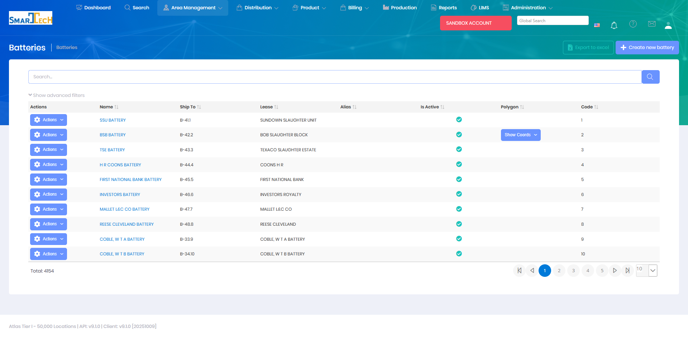

# Batteries

Batteries are groupings of related well locations, typically representing wells that share common facilities or infrastructure. Batteries provide an intermediate organizational level between leases and individual locations.

## Overview

The Batteries page manages battery groupings of well locations. Batteries are used to organize locations that share production facilities, pipelines, or operational characteristics, making it easier to manage related wells as a group.

The Batteries grid displays all battery records with the following information:
* **Name** - Battery name/identifier
* **Ship To** - Delivery identifier code
* **Lease** - Associated lease name
* **Alias** - Alternative battery name
* **Is Active** - Current status indicator
* **Polygon** - Geographic boundary definition (with "Show Coords" option)
* **Code** - Internal battery code

The system manages 4,154 battery groupings with support for creating, editing, exporting to Excel, and advanced filtering. Examples include SSU BATTERY, BSB BATTERY, TSE BATTERY, and others organized by lease and geographical area.

## Key Features

* Create and manage battery groupings
* Assign unique battery codes
* Associate locations with batteries
* Link batteries to leases and areas
* Track battery-level production and operations
* Configure shared equipment and infrastructure

## Permissions

Access to Batteries features requires the following permissions:

| Display Name | Description |
|--------------|-------------|
| Batteries | View battery records |
| Create Batteries | Create new batteries |
| Edit Batteries | Modify existing batteries |
| Delete Batteries | Remove battery records |

**Related Permissions:**

| Display Name | Description |
|--------------|-------------|
| [Locations](Locations.md) | View locations within batteries |
| [Leases](Leases.md) | View leases (battery parent) |
| [Areas](Areas.md) | View areas (organizational region) |

## Related Documentation

* [Data Import - Batteries](../Imports/Batteries.md) - Bulk import battery data
* [Locations](Locations.md) - Individual locations within batteries

