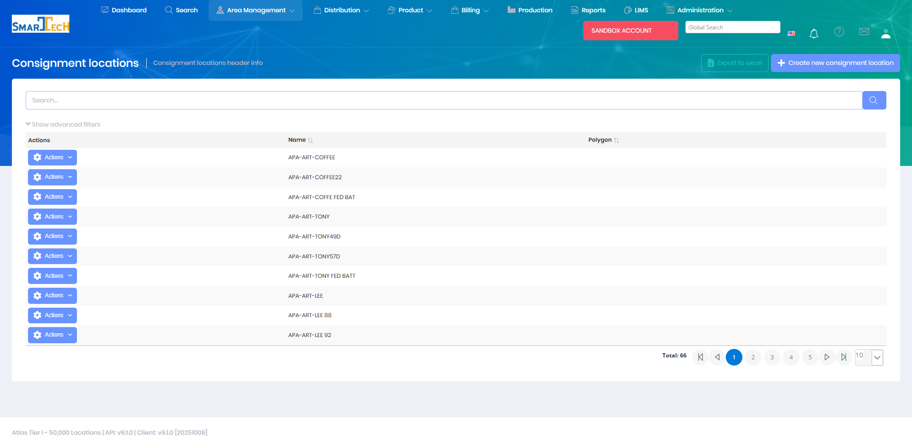

# Consignment Locations

Consignment Locations are sites where inventory is stored on-site for customer use, with billing occurring only when product is consumed. This module manages consignment inventory tracking and usage monitoring at designated locations.

## Overview

The Consignment Locations page manages locations where consignment inventory arrangements are in place. These locations maintain on-site inventory that is owned by the supplier until consumed by the customer.

The Consignment Locations grid displays:
* **Name** - Consignment location identifier
* **Polygon** - Geographic boundary definition

The system manages 66 consignment locations with support for creating, editing, exporting to Excel, and filtering. These locations represent sites where inventory is stored on-site and billing occurs only when product is consumed.

## Key Features

* Designate locations as consignment sites
* Track on-site inventory levels
* Monitor product consumption
* Manage replenishment triggers and thresholds
* Generate consumption-based billing
* Audit consignment inventory usage

## Permissions

Access to Consignment Locations features requires the following permissions:

| Display Name | Description |
|--------------|-------------|
| Consignment Locations | View consignment location records |
| Create Consignment Locations | Create new consignment arrangements |
| Edit Consignment Locations | Modify consignment details |
| Delete Consignment Locations | Remove consignment arrangements |

**Related Permissions:**

| Display Name | Description |
|--------------|-------------|
| [Locations](Locations.md) | View locations (consignment sites) |
| [Products](../Product/Products.md) | View products (consigned items) |
| [Product Inventory](../Product/ProductInventory.md) | Track consignment inventory |
| [Treatments](../Distribution/Treatments.md) | View consumption records |
| [Invoices](../Billing/Invoices.md) | Generate consumption-based billing |

## Related Documentation

* [Locations](Locations.md) - Location management
* [Location Tank Inventory](../Product/LocationTankInventory.md) - Tank level tracking
* [Product Inventory](../Product/ProductInventory.md) - Inventory management

