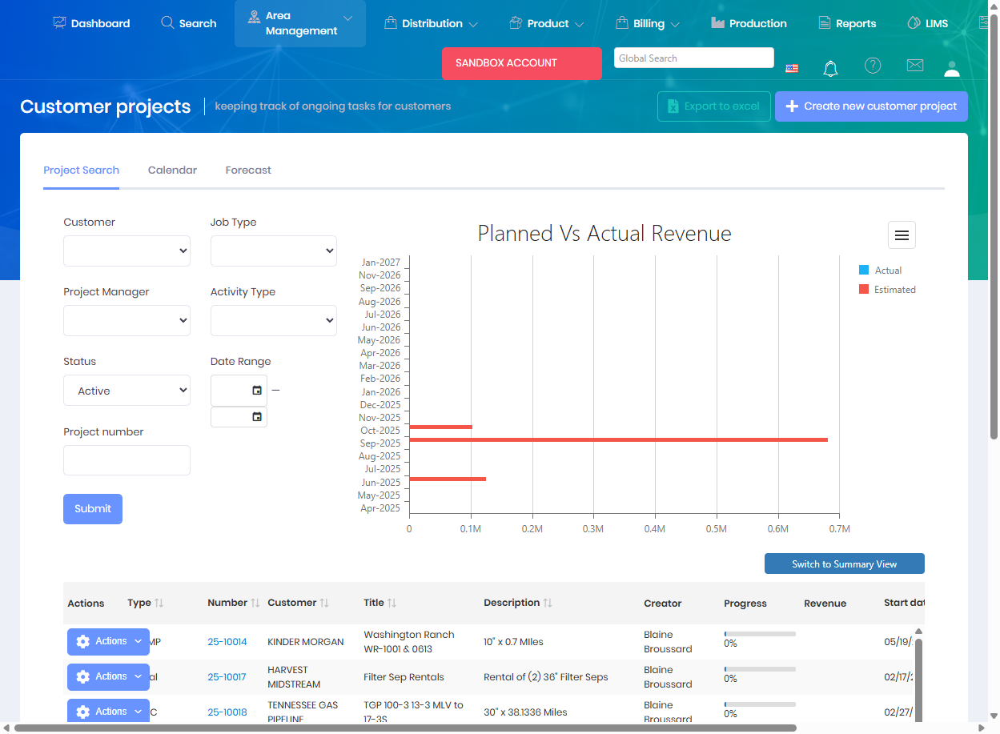

# Customer Projects

Customer Projects represent specific projects, wells, or operational initiatives associated with a customer. Projects help organize locations, costs, and activities related to a particular customer engagement or job.

## Overview

The Customer Projects page allows you to create and manage projects for your customers. Each project can be linked to specific locations, leases, and areas, providing a way to track work and costs related to a particular customer initiative.

The Customer Projects interface includes:
* **Project Search Tab** - Search and filter projects by customer, project manager, status, or project number
* **Calendar Tab** - View projects in a calendar format
* **Forecast Tab** - Project forecasting and planning
* **Planned vs Actual Revenue Chart** - Visual comparison of estimated vs actual revenue
* **Project Grid** - Detailed list showing project number, customer, title, description, creator, progress, revenue, and start date
* **Job Type and Activity Type Filters** - Refine projects by type of work (OFFIMP, Rental, HYDRO, Chemical, etc.)

## Key Features

* Create projects for specific customers
* Assign locations and leases to projects
* Configure project-specific ledger accounts
* Track project status and timelines
* Associate costs and billing to projects
* Report on project-level activity and performance

## Permissions

Access to Customer Projects features requires the following permissions:

| Display Name | Description |
|--------------|-------------|
| Customer Projects | View customer project records |
| Create Customer Projects | Create new customer projects |
| Edit Customer Projects | Modify existing customer projects |
| Delete Customer Projects | Remove customer project records |

**Related Permissions:**

| Display Name | Description |
|--------------|-------------|
| [Customers](Customers.md) | View customers (project owners) |
| [Locations](Locations.md) | View/assign locations to projects |
| [Leases](Leases.md) | View/assign leases to projects |
| [Invoices](../Billing/Invoices.md) | View project-related billing |

## Related Documentation

* [Customers](Customers.md) - Customer management
* [Locations](Locations.md) - Location management
* [Invoices](../Billing/Invoices.md) - Project billing

