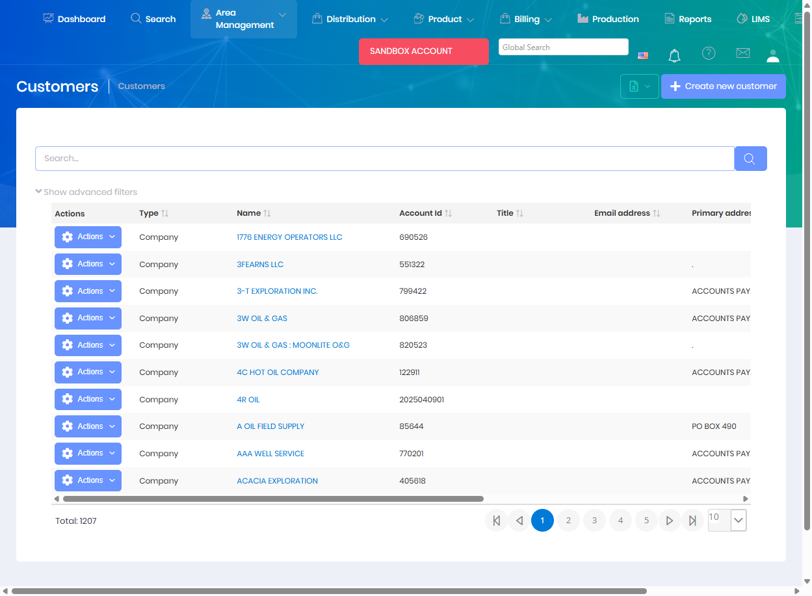

# Customers

Customers are the organizations or companies that you provide services to. The Customers module manages customer information, contact details, billing settings, and relationships to locations and projects.

## Overview

The Customers page displays a list of all customer organizations in the system. Each customer can have multiple associated entities including customer projects, leases, locations, and contacts. Customer records are used throughout Atlas for billing, reporting, and operational tracking.

The Customers grid displays all customer records with the following information:
* **Type** - Customer classification (Company, Individual, etc.)
* **Name** - Customer organization name
* **Account Id** - Unique customer identifier
* **Title** - Contact person title
* **Email address** - Primary contact email
* **Primary address** - Physical address
* **City, State, Zip** - Location information
* **Is Active** - Current status indicator

## Key Features

* Create and manage customer organizations
* Track customer contacts and communication details
* Configure billing preferences and terms
* Link customers to locations, leases, and projects
* Manage customer-specific pricing and product configurations
* View customer activity history and associated records

## Permissions

Access to Customers features requires the following permissions:

| Display Name | Description |
|--------------|-------------|
| Customers | View customer records |
| Create Customers | Create new customers |
| Edit Customers | Modify existing customers |
| Delete Customers | Remove customer records |

**Related Permissions:**

| Display Name | Description |
|--------------|-------------|
| [Customer Projects](CustomerProjects.md) | View/manage customer projects |
| [Locations](Locations.md) | View locations (linked to customers) |
| [Leases](Leases.md) | View leases (linked to customers) |
| [Sales Orders](../Distribution/SalesOrders.md) | Create orders for customers |
| [Price Schedules](../Product/PriceSchedules.md) | Manage customer-specific pricing |
| [Invoices](../Billing/Invoices.md) | View customer invoices |

## Related Documentation

* [Customer Projects](CustomerProjects.md) - Projects for specific customers
* [Data Import - Customers](../Imports/Customers.md) - Bulk import customer data

