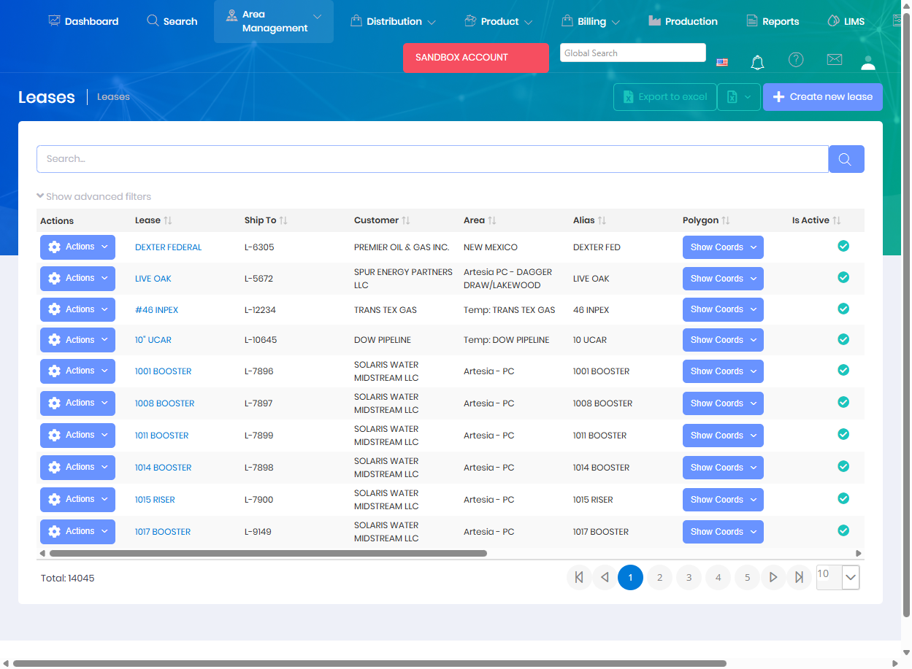

# Leases

Leases represent the legal properties or land agreements where well locations are situated. Leases provide the organizational structure for grouping locations by property and are used throughout the system for reporting and operational management.

## Overview

The Leases page manages lease properties including lease codes, names, associated areas, and related metadata. Leases are a key organizational entity used to group locations and track production and treatments by property.

The Leases grid displays all lease records with the following information:
* **Lease** - Lease name/identifier
* **Ship To** - Delivery identifier code
* **Customer** - Customer organization associated with the lease
* **Area** - Geographical area where the lease is located
* **Alias** - Alternative lease name or code
* **Is Active** - Current status indicator
* **Polygon** - Geographic boundary definition (with "Show Coords" option for viewing coordinates)
* **Code** - Internal lease code

The system manages over 14,000 lease properties with support for filtering, searching, and bulk operations.

## Key Features

* Create and manage lease properties
* Assign unique lease codes and identifiers
* Link leases to areas and customers
* Associate multiple locations to each lease
* Track lease-level production and activity
* Configure lease-specific settings and preferences

## Permissions

Access to Leases features requires the following permissions:

| Display Name | Description |
|--------------|-------------|
| Leases | View lease records |
| Create Leases | Create new leases |
| Edit Leases | Modify existing leases |
| Delete Leases | Remove lease records |

**Related Permissions:**

| Display Name | Description |
|--------------|-------------|
| [Areas](Areas.md) | View areas (lease regions) |
| [Locations](Locations.md) | View locations within leases |
| [Customers](Customers.md) | View customers (lease owners) |

## Related Documentation

* [Data Import - Leases](../Imports/Leases.md) - Bulk import lease data
* [Areas](Areas.md) - Parent organizational level for leases

