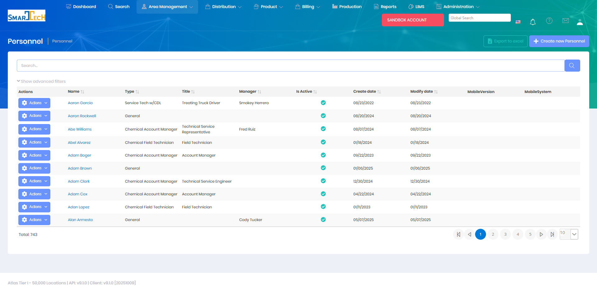

# Personnel

Personnel manages information about field staff, technicians, and employees who perform operational work. Personnel records track contact information, roles, certifications, and work assignments.

## Overview

The Personnel page maintains a directory of field staff and employees. Personnel records are linked to system users and are used for assignment tracking, reporting, and operational planning.

The Personnel grid displays all personnel records with the following information:
* **Name** - Employee name
* **Type** - Personnel classification (Service Tech w/CDL, Chemical Account Manager, Chemical Field Technician, etc.)
* **Title** - Job title (Treating Truck Driver, Account Manager, Field Technician, Technical Service Representative, etc.)
* **Manager** - Assigned supervisor
* **Is Active** - Current employment status
* **Create date** - Record creation date
* **Modify date** - Last modification date
* **MobileVersion** - Mobile app version (if applicable)
* **MobileSystem** - Mobile device system (if applicable)

The system manages 743 personnel records with support for creating, editing, exporting to Excel, and advanced filtering.

## Key Features

* Create and manage personnel records
* Track contact information and emergency contacts
* Assign personnel types and roles
* Link personnel to system users
* Manage certifications and qualifications
* Track area and region assignments
* Record personnel notes and history

## Permissions

Access to Personnel features requires the following permissions:

| Display Name | Description |
|--------------|-------------|
| Personnel | View personnel records |
| Create Personnel | Create new personnel records |
| Edit Personnel | Modify existing personnel records |
| Delete Personnel | Remove personnel records |

**Related Permissions:**

| Display Name | Description |
|--------------|-------------|
| [Users](../System/Users.md) | View/manage user accounts (linked to personnel) |
| [Treatment Routes](../Distribution/TreatmentRoutes.md) | Assign personnel to routes |
| [Delivery Orders](../Distribution/DeliveryOrders.md) | Assign personnel to deliveries |
| [Areas](Areas.md) | View areas (personnel assignments) |

## Related Documentation

* [Data Import - Personnel](../Imports/Personnel.md) - Bulk import personnel data
* [Users](../System/Users.md) - System user accounts linked to personnel

