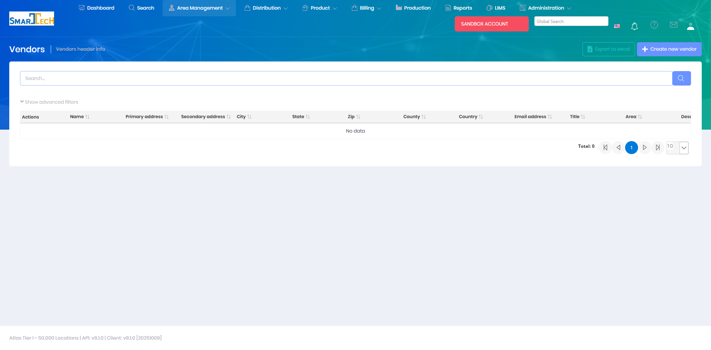

# Vendors

Vendors are external companies or suppliers that provide products, services, or materials to your organization. The Vendors module manages vendor information, contacts, and relationships for purchasing and supplier management.

## Overview

The Vendors page maintains a directory of supplier companies and service providers. Vendor records include contact information, payment terms, and are used for purchase order creation and supplier management.

The Vendors grid includes columns for:
* **Name** - Vendor company name
* **Primary address** - Main business address
* **Secondary address** - Additional address
* **City, State, Zip** - Location information
* **County** - County location
* **Country** - Country
* **Email address** - Primary contact email
* **Title** - Contact person title
* **Area** - Operational area
* **Description** - Vendor description
* **Phone** - Contact phone number
* **Website** - Vendor website
* **Is company** - Company vs individual indicator
* **Legal Name** - Official business name
* **Alias** - Alternative name
* **Is Active** - Current status

The interface supports creating new vendors, editing existing records, and exporting to Excel.

## Key Features

* Create and manage vendor records
* Track vendor contact information
* Manage payment terms and preferences
* Link vendors to purchase orders
* Record vendor notes and performance data
* Organize vendors by type or category

## Permissions

Access to Vendors features requires the following permissions:

| Display Name | Description |
|--------------|-------------|
| Vendors | View vendor records |
| Create Vendors | Create new vendors |
| Edit Vendors | Modify existing vendors |
| Delete Vendors | Remove vendor records |

**Related Permissions:**

| Display Name | Description |
|--------------|-------------|
| [Purchase Orders](../Product/PurchaseOrders.md) | Create purchase orders for vendors |

## Related Documentation

* [Purchase Orders](../Product/PurchaseOrders.md) - Orders from vendors

