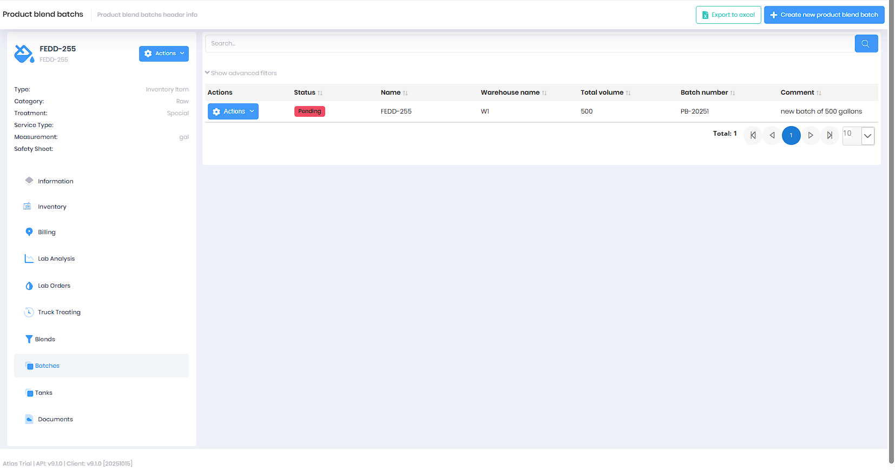

# Product Blends Management

The Product Blends system allows you to create, manage, and track blended chemical products. This feature enables you to define product formulations, organize them into groups, and manage physical batches of blended products.

**Permission:** `Pages.ProductBlends`

 

## Overview

The Product Blends system consists of three main components:

* **[Product Blends](#product-blends)** - Define relationships between products and their blend percentages
* **[Product Blend Groups](#product-blend-groups)** - Organize blends into named groups with date ranges
* **[Blend Batches](#blend-batches)** - Track physical production batches

The Product Blends page has two main tabs:
* **Groups Tab** - Manage product blend groups (formulations)
* **Blends Tab** - View and manage the component products within each group

*Product Blend Groups tab showing active formulations*

 

## Product Blends

Product Blends define the composition of a blended product by specifying which products are combined and their percentages within a blend group.

### Viewing Product Blends

Navigate to **Production > Product Blends** to view all product blends in the system. Click the **Blends** tab to see the blends displayed in a grouped data grid, organized by Product Blend Group. Each group shows the component products and their blend percentages.

*Product Blends tab showing component products and percentages (e.g., Hot Water 20%, FEDD-255 80%)*

You can also view blends from a specific product's detail page by navigating to the product and clicking the **Blends** tab.

*Viewing blends from a product detail page*

### Creating a New Product Blend

1. Click the **Create New Product Blend** button
2. Click **Pick** to select a **Product** from the product catalog
3. Choose a **Product Blend Group** from the dropdown (the formulation this component belongs to)
4. Enter the **Percentage** - The proportion of this product in the blend (0-100)
5. Click **Save**

*Create new product blend dialog showing product selection, blend group, and percentage fields*

#### Product Blend Fields

* **Product** (Required) - The product that is part of this blend. Use the "Pick" button to search and select from available products.
* **Product Blend Group** (Required) - The group this blend belongs to. Groups help organize related blends together.
* **Percentage** (Required) - The percentage of this product in the blend (0-100). The system validates that the total percentage of all products in a blend group does not exceed 100%.

> **Note:** The system will prevent you from saving if the total percentage of all products in the selected blend group would exceed 100%.

### Editing a Product Blend

1. Click the **Edit** (pencil) icon next to the blend you want to modify
2. Update the desired fields
3. Click **Save**

### Deleting a Product Blend

1. Click the **Delete** (trash) icon next to the blend you want to remove
2. Confirm the deletion when prompted

### Advanced Filtering

Click **Show Advanced Filters** to filter blends by:

* **Percentage** - Filter by minimum and maximum percentage values
* **Product Name** - Filter by the name of the product in the blend
* **Product2 Name** - Additional product name filter

### Export to Excel

Click the **Export to Excel** button to download all product blends data in spreadsheet format.

 

## Product Blend Groups

Product Blend Groups organize related product blends together and define when those blend formulations are active. Each group represents a complete formulation (recipe) with a name, active date range, and associated component products.

### Accessing Product Blend Groups

From the Product Blends page, click the **Groups** tab to view and manage blend groups.

Alternatively, click the **Create New Product Blend Group** button from the main Blends view.

*Create new product blend group dialog*

### Creating a New Product Blend Group

1. Click the **Create New Product Blend Group** button
2. Enter a **Name** for the group (Required) - This is the formula/recipe name (e.g., "FEDD-255 A1")
3. Select a **Start Date** (Required) - When this blend formulation becomes active
4. Optionally select an **End Date** - When this blend formulation expires or is replaced
5. Check **Is Active** to make this group immediately available for use in production batches
6. Click **Save**

#### Product Blend Group Fields

* **Name** (Required) - A descriptive name for the blend group (max 100 characters)
* **Start Date** (Required) - The date when this blend formulation becomes effective
* **End Date** (Optional) - The date when this blend formulation expires or is replaced
* **Is Active** - Toggle to enable or disable this blend group for use in new batches

### Editing a Product Blend Group

1. Locate the group in the Groups tab
2. Click the **Edit** button
3. Update the desired fields
4. Click **Save**

### Deleting a Product Blend Group

1. Click the **Delete** button next to the group
2. Confirm the deletion when prompted

> **Warning:** Deleting a blend group will affect any associated product blends. Ensure the group is no longer needed before deletion.

### Filtering Product Blend Groups

Use the advanced filters to search by:

* **Name** - Filter by group name
* **Start Date** - Filter by date range
* **End Date** - Filter by date range  
* **Is Active** - Show only active or inactive groups
* **Product Name** - Filter by associated product

 

## Blend Batches

Blend Batches track the physical production of blended products, including volume produced, warehouse location, batch tracking information, and completion status. Each batch record documents a specific production run using a defined blend formulation.

### Accessing Blend Batches

Navigate to **Production > Blend Batches** to view and manage production batches. You can also access batches from a specific product's detail page by clicking the **Batches** tab.

*Blend Batches showing status, warehouse, volume, batch number, and comments*

*Viewing batches from a product detail page*

### Creating a New Blend Batch

1. Click the **Create New Blend Batch** button
2. Click **Pick** to select a **Product** (the final blended product being produced)
3. Choose a **Product Blend Group** from the dropdown (the formulation to use for this batch)
4. Select a **Warehouse** where the batch will be produced and stored
5. Enter the **Total Volume** produced (in the product's unit of measure)
6. Optionally add a **Comment** describing the batch (e.g., "new batch of 500 gallons")
7. Click **Save**

*Create new blend batch dialog with product, blend group, warehouse, volume, and comment fields*

The system will automatically assign a unique **Batch Number** (e.g., PB-20251) for tracking and traceability.

#### Blend Batch Fields

* **Product** (Required) - The final blended product being produced. Use the "Pick" button to select from available products.
* **Product Blend Group** (Required) - The blend formulation to use for this batch.
* **Warehouse** (Required) - The warehouse location where this batch is stored.
* **Total Volume** (Optional) - The total volume of product produced in this batch.
* **Batch Number** - Automatically generated unique identifier for tracking this batch.
* **Products** - Automatically populated based on the selected blend group.
* **Comment** (Optional) - Additional notes or information about this batch (max 500 characters).

### Managing Blend Batches

Each batch has an **Actions** menu providing the following options:

* **View** - View complete batch details including all component products and their quantities
* **Print** - Generate and print the Blend Batch Report with all batch details and blend composition
* **Edit** - Modify batch information (available for pending batches)
* **Complete** - Mark the batch as completed and finalize the inventory transaction
* **Delete** - Remove the batch record (with confirmation)
* **History** - View audit log of changes to this batch

### Batch Status

Batches progress through the following statuses:

* **Pending** (Red badge) - Batch is created but production not yet complete
* **Completed** (Green badge) - Batch production is finished and inventory is updated

### Completing a Batch

Once a batch production is finished:

1. Click the **Actions** button for the batch
2. Select **Complete**
3. The batch status changes from "Pending" to "Completed"
4. Inventory transactions are finalized (component products consumed, finished product added)

> **Note:** Once a batch is completed, some fields become locked to maintain production integrity and traceability.

### Editing a Blend Batch

1. Click the **Actions** button next to the batch
2. Select **Edit**
3. Update the desired fields (Product, Blend Group, Warehouse, Total Volume, Comment)
4. Click **Save**

> **Note:** Editing capabilities may be restricted after a batch is completed.

### Deleting a Blend Batch

1. Click the **Actions** button next to the batch
2. Select **Delete**
3. Confirm the deletion when prompted

> **Warning:** Deleting a completed batch may affect inventory records. Consult with your supervisor before deleting completed batches.

### Advanced Filtering

Click **Show Advanced Filters** to filter batches by:

* **Total Volume** - Filter by minimum and maximum volume
* **Batch Number** - Search by batch number
* **Products** - Filter by products used in the blend
* **Comment** - Search comments
* **Product Name** - Filter by product name
* **Warehouse Name** - Filter by warehouse location

### Export to Excel

Click the **Export to Excel** button to download all product blend batch data in spreadsheet format.

 

## Best Practices

### Setting Up Blend Formulations

1. **Create Product Blend Groups first** - Define your blend formulation groups with clear names and appropriate date ranges
2. **Add Products to Groups** - Create product blends within each group, ensuring percentages total 100%
3. **Activate Groups** - Set blend groups to "Active" when ready for production use

### Managing Blend Percentages

* Always verify that the sum of percentages in a blend group equals 100%
* The system validates that you cannot exceed 100% total
* Update blend formulations by adjusting existing percentages or adding/removing products

### Production Workflow

1. Create a Product Blend Group with the desired formulation
2. Add all component products with their percentages to the group
3. When ready to produce, create a Blend Batch selecting the group
4. Record the total volume produced
5. Complete the batch when finished
6. Print batch reports for quality control and record keeping

### Date Range Management

* Use Start and End dates to track different versions of blend formulations over time
* Keep historical blend groups for reference, even if no longer active
* Set future-dated blend groups when planning formulation changes

 

## Permissions

Access to Product Blends features is controlled by the following permissions:

* `Pages.ProductBlends.Create` - Create new product blends
* `Pages.ProductBlends.Edit` - Edit existing product blends  
* `Pages.ProductBlends.Delete` - Delete product blends
* `Pages.ProductBlendGroups.Create` - Create new blend groups
* `Pages.ProductBlendGroups.Edit` - Edit existing blend groups
* `Pages.ProductBlendGroups.Delete` - Delete blend groups
* `Pages.ProductBlendBatchs.Create` - Create new production batches
* `Pages.ProductBlendBatchs.Edit` - Edit existing batches
* `Pages.ProductBlendBatchs.Delete` - Delete batches

Contact your system administrator if you need access to any of these features.