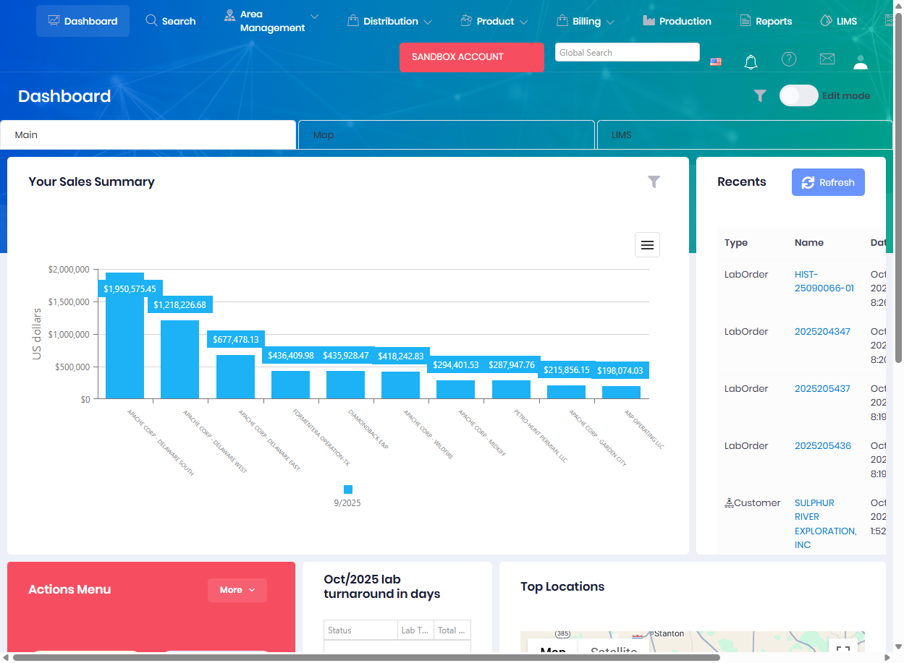

# Dashboard

The Dashboard provides a centralized view of key metrics and information relevant to your role within Atlas. There are three dashboard variants available depending on your access level: Host Dashboard for system administrators, Portal Dashboard for customer portal users, and Tenant Dashboard for internal users managing operations.

## Dashboard Types

### Host Dashboard
The Host Dashboard is available to system administrators and provides high-level oversight of all tenants, system performance, and administrative metrics across the entire Atlas platform.

### Portal Dashboard  
The Portal Dashboard is designed for customer portal users to view location data, documents, and other customer-facing information relevant to their account.

### Tenant Dashboard
The Tenant Dashboard is the main operational dashboard for internal users, displaying production metrics, orders, treatments, and day-to-day operational information.

The Tenant Dashboard includes:
* **Actions Menu** - Quick access to frequently used features (Delivery Orders, Lab Orders, Search, Reports)
* **Your Sales Summary** - Visual chart showing sales data by customer/location over time
* **Recents** - Recent activity including lab orders, customers, leases, and locations
* **Lab Turnaround Time** - Monthly metrics for lab processing times
* **Top Locations** - Map view of key locations with geographic distribution

## Customization

All dashboards can be customized to display the widgets and information most relevant to your workflow. See [Dashboard Configuration](../Web/dashboard/customizing.md) for details on customizing your dashboard layout.

## Permissions

Access to Dashboard features requires the following permissions:

| Display Name | Description |
|--------------|-------------|
| Host Dashboard | View host administrator dashboard (system-wide) |
| Portal Dashboard | View customer portal dashboard |
| Tenant Dashboard | View operational tenant dashboard |

**Related Permissions:**

| Display Name | Description |
|--------------|-------------|
| [Locations](../AreaManagement/Locations.md) | View locations (dashboard widgets) |
| [Treatments](../Distribution/Treatments.md) | View treatments (dashboard widgets) |
| [Delivery Orders](../Distribution/DeliveryOrders.md) | View delivery orders (dashboard widgets) |
| [Invoices](../Billing/Invoices.md) | View billing information (dashboard widgets) |

## Related Documentation

* [Dashboard Customization](../Web/dashboard/customizing.md) - Customize dashboard layout

