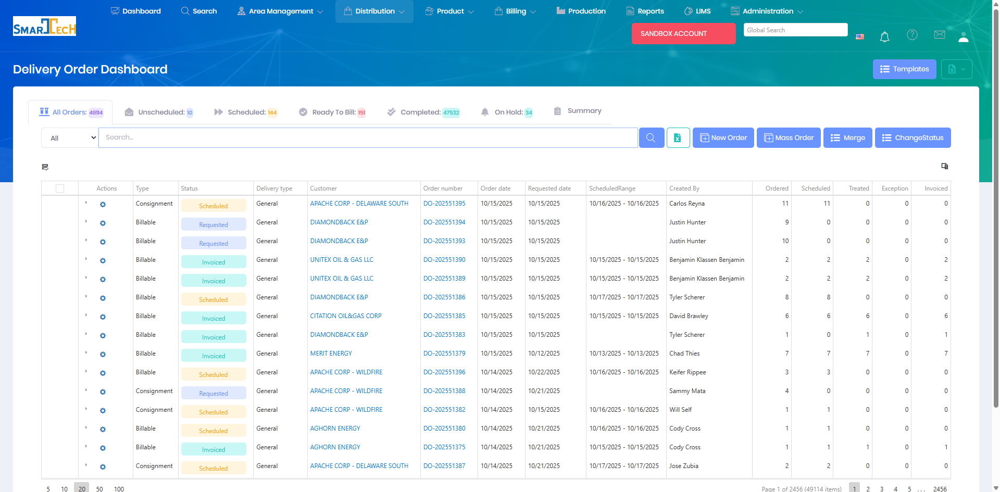

# Delivery Orders

Delivery Orders represent scheduled deliveries of products to customer locations. These orders are created from sales orders and track the dispatch, delivery, and completion of product deliveries.

## Overview

The Delivery Orders page provides a dashboard for managing all delivery orders in the system. Orders can be filtered by status, date, route, or location to help dispatchers and operations staff coordinate deliveries efficiently.

The Delivery Order Dashboard displays:
* **Status Tabs** - Quick filters by status:
  - All Orders (49,114 total)
  - Unscheduled (10)
  - Scheduled (144)
  - Ready To Bill (181)
  - Completed (47,632)
  - On Hold (34)
  - Summary view
* **Filter Options** - Priority, Status, and Batch filters for refined searching
* **Order Grid** - Comprehensive list showing:
  - Status (color-coded: Scheduled, Requested, Invoiced)
  - Type (Consignment, Billable)
  - Delivery type (General)
  - Customer name
  - Order number
  - Order date
  - Requested date
  - Schedule Range
  - Created By
  - Ordered, Scheduled, Treated, Exception, and Invoiced counts
* **Action Buttons** - New Order, Mass Order, Merge, Change Status, Templates

The dashboard provides powerful tools for dispatchers and operations staff to coordinate deliveries, track order progress, and manage exceptions.

## Key Features

* Create delivery orders from sales orders
* Schedule delivery dates and times
* Assign orders to routes and vehicles
* Track order status from creation to completion
* Record actual delivery quantities and details
* Generate delivery documentation and tickets
* Monitor order fulfillment and exceptions

## Permissions

Access to Delivery Orders features requires the following permissions:

| Display Name | Description |
|--------------|-------------|
| Delivery Orders | View delivery order records |
| Create Delivery Orders | Create new delivery orders |
| Edit Delivery Orders | Modify delivery order details |
| Delete Delivery Orders | Remove delivery order records |
| Edit Override | Override edit restrictions on delivery orders |
| Delete Override | Override delete restrictions on delivery orders |
| Allowed To Schedule | Schedule delivery orders for execution |
| Delivery Driver | Access delivery driver functions |
| Delivery Order Items | View delivery order line items |
| Create Delivery Order Items | Add products to delivery orders |
| Edit Delivery Order Items | Modify delivery order line items |
| Delete Delivery Order Items | Remove products from delivery orders |

**Related Permissions:**

| Display Name | Description |
|--------------|-------------|
| [Sales Orders](SalesOrders.md) | View sales orders (source for delivery orders) |
| [Locations](../AreaManagement/Locations.md) | View locations (delivery destinations) |
| [Treatment Routes](TreatmentRoutes.md) | View routes (for route-based deliveries) |
| [Products](../Product/Products.md) | View products (delivered items) |
| [Product Inventory](../Product/ProductInventory.md) | View inventory (consumed on delivery) |
| [Order Tracker](OrderTracker.md) | Track delivery order status in real-time |

## Related Documentation

* [Mobile - Delivery Orders](../Mobile/DeliveryOrders.md) - Complete deliveries on mobile devices
* [Sales Orders](SalesOrders.md) - Source for delivery orders

