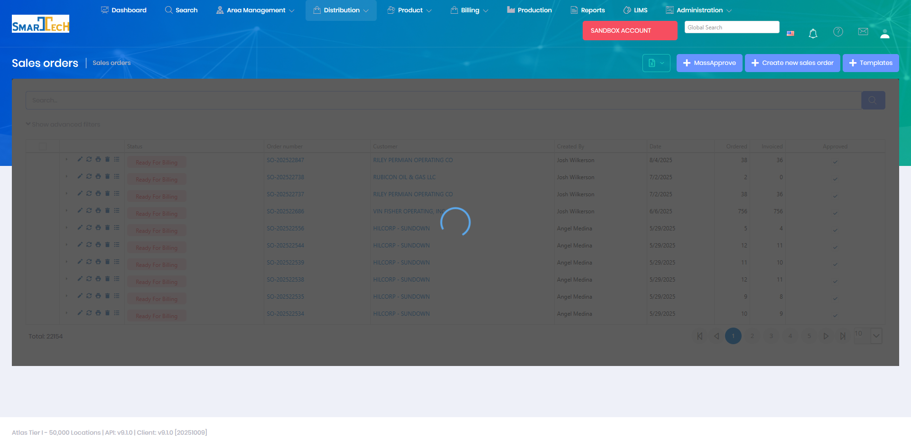

# Sales Orders

Sales Orders document customer purchases of products and services. Sales orders are the starting point for the order-to-cash process and are used to create delivery orders and generate invoices.

## Overview

The Sales Orders page manages all customer orders including one-time purchases, recurring service orders, and contract-based deliveries. Each sales order specifies products, quantities, pricing, and delivery requirements.

The Sales Orders grid displays all customer orders with:
* **Select all** - Checkbox for bulk operations
* **Status** - Color-coded order status (Ready for Billing shown)
* **Order number** - Unique sales order identifier
* **Customer** - Customer organization name
* **Created By** - User who created the order
* **Date** - Order creation date
* **Ordered** - Count of ordered items
* **Invoiced** - Count of invoiced items
* **Approved** - Approval status

The interface includes action buttons for:
* **MassApprove** - Bulk approval of multiple orders
* **Create new sales order** - Add new customer orders
* **Templates** - Use pre-configured order templates

The system manages 22,854 sales orders with advanced filtering capabilities and bulk operations support.

## Key Features

* Create sales orders for customers
* Add products and services with quantities and pricing
* Configure recurring order schedules
* Link orders to specific locations or projects
* Generate delivery orders from sales orders
* Track order fulfillment status
* Manage order changes and cancellations
* Apply customer-specific pricing and discounts

## Permissions

Access to Sales Orders features requires the following permissions:

| Display Name | Description |
|--------------|-------------|
| Sales Orders | View sales order records |
| Create Sales Orders | Create new sales orders |
| Edit Sales Orders | Modify existing sales orders |
| Delete Sales Orders | Remove sales order records |
| Swap Products | Swap products on existing sales orders |
| Sales Order Items | View sales order line items |
| Create Sales Order Items | Add products to sales orders |
| Edit Sales Order Items | Modify sales order line items |
| Delete Sales Order Items | Remove products from sales orders |

**Related Permissions:**

| Display Name | Description |
|--------------|-------------|
| [Customers](../AreaManagement/Customers.md) | View customers (required to create orders) |
| [Locations](../AreaManagement/Locations.md) | View locations (required to specify delivery location) |
| [Products](../Product/Products.md) | View products (required to add items to orders) |
| [Price Schedules](../Product/PriceSchedules.md) | View pricing (used for order pricing) |
| [Delivery Orders](DeliveryOrders.md) | View/create delivery orders from sales orders |

## Related Documentation

* [Mobile - Sales Orders](../Mobile/SalesOrders.md) - View and manage sales orders on mobile
* [Delivery Orders](DeliveryOrders.md) - Orders generated from sales orders

