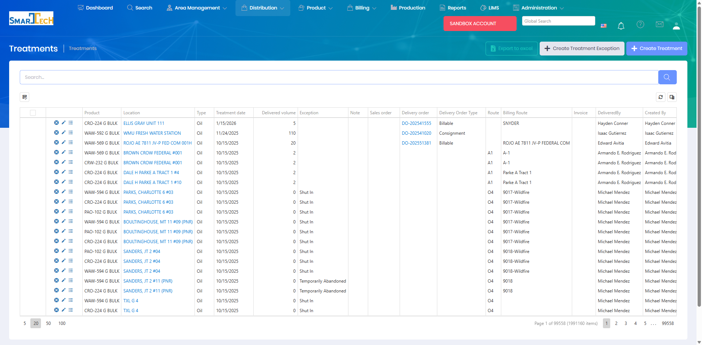

# Treatments

Treatments are records of chemical applications and services performed at customer locations. Treatment records document what was done, products used, quantities applied, and results observed.

## Overview

The Treatments page displays all treatment records across locations and timeframes. Treatments can be created manually or recorded via mobile devices in the field, capturing detailed information about each service visit.

The Treatments grid displays all treatment records with:
* **Product** - Chemical or product applied (e.g., ELLIS GRAY BULK, WAW-592 G BULK, etc.)
* **Location** - Well or facility where treatment occurred
* **Type** - Treatment type (Oil treatments shown)
* **Treatment date** - Date of application
* **Delivered volume** - Quantity delivered/applied
* **Exception** - Special conditions (Shut In, Temporarily Abandoned, etc.)
* **Note** - Additional treatment notes
* **Sales order** - Associated sales order number
* **Delivery order** - Associated delivery order number
* **Delivery Order Type** - Consignment or Billable
* **Route** - Treatment route identifier
* **Billing Route** - Billing route code
* **Invoice** - Invoice number
* **DeliveredBy** - Personnel who performed the treatment
* **Created By** - User who created the record

The system manages 99,558 treatments with nearly 2 million individual treatment items. The interface supports:
* Creating Treatment Exceptions
* Creating new Treatments
* Exporting to Excel
* Advanced filtering and search

## Key Features

* View and search treatment history
* Record treatment details and observations
* Track products used and quantities applied
* Document treatment results and conditions
* Link treatments to delivery orders
* Capture photos and notes in the field
* Generate treatment reports
* Use treatment data for billing and analysis

## Permissions

Access to Treatments features requires the following permissions:

| Display Name | Description |
|--------------|-------------|
| Treatments | View treatment records |
| Create Treatments | Create new treatment records |
| Edit Treatments | Modify existing treatment records |
| Delete Treatments | Remove treatment records |
| Duplicates | View and manage duplicate treatments |
| Approvals | Approve treatment records for billing |

**Related Permissions:**

| Display Name | Description |
|--------------|-------------|
| [Locations](../AreaManagement/Locations.md) | View locations (where treatments occur) |
| [Products](../Product/Products.md) | View products (used in treatments) |
| [Delivery Orders](DeliveryOrders.md) | View delivery orders (linked to treatments) |
| [Treatment Routes](TreatmentRoutes.md) | View routes (treatment organization) |
| [Invoices](../Billing/Invoices.md) | View invoices (treatments generate billing) |

## Related Documentation

* [Mobile - Treating](../Mobile/Treating.md) - Record treatments on mobile devices
* [Mobile - Treatments](../Mobile/Treatments.md) - View treatment history on mobile

