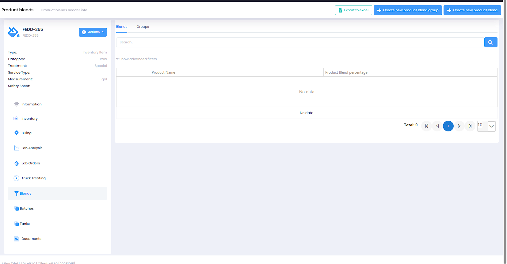
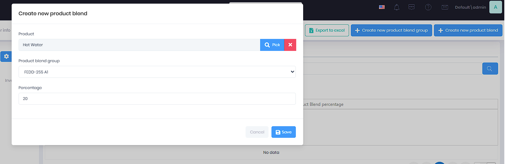
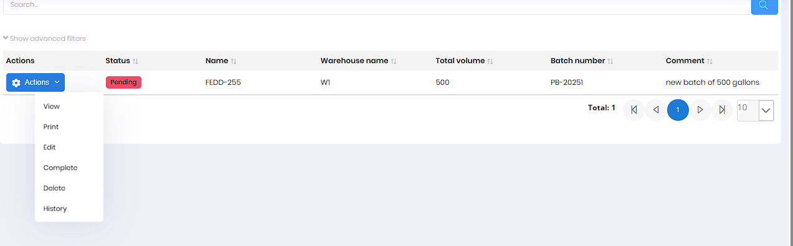
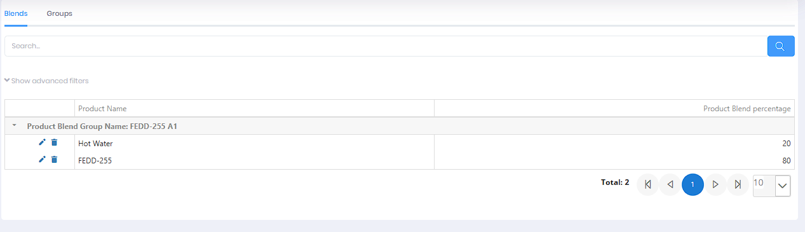

# Product Blending

## Overview

Product blending creates custom chemical formulations by mixing component products according to specific recipes or ratios. This workflow is used by blending operators and production staff to record blend batch creation, track component products consumed, generate finished product inventory, and request quality control testing. Proper batch tracking ensures product quality, inventory accuracy, and regulatory compliance.

## Prerequisites

**Required Permission:** `Pages.ProductBlendBatchs`

**Required Setup:**
* Component products must exist in catalog
* Finished blend product must be configured
* Warehouse for blending operations set up
* Blend formulas/recipes may be predefined
* Lab QC fields configured if testing required

**Related Prerequisites:**
* [Product Setup](ProductSetup.md) - All products must exist
* [Inventory Management](InventoryManagement.md) - Component inventory available

## Workflow Diagram

```
Create Blend Group (Formula) → Add Component Products & Percentages → Set Start/End Dates
       ↓
Create Batch Record → Select Product & Blend Group → Specify Warehouse & Volume
       ↓
Complete Batch → Consume Component Inventory → Add Finished Product → Request QC Testing (optional)
       ↓
Print Batch Report → Update Inventory → Generate Documentation
```

## Step-by-Step Procedure

### Setting Up Blend Formulations (One-Time Setup)

Before creating batches, you need to define your blend formulations:

1. **Navigate to Product Blends**
   * Go to main menu → Product → Product Blends
   * Click the **Groups** tab


*Product Blend Groups showing active formulations*

2. **Create a Product Blend Group** (Formula)
   * Click **Create New Product Blend Group**
   * Enter **Name** (e.g., "FEDD-255 A1")
   * Set **Start Date** (when formulation becomes active)
   * Optionally set **End Date** (when formulation expires)
   * Check **Is Active** to enable for production
   * Click **Save**


*Creating a new product blend group*

3. **Add Component Products to the Group**
   * Click the **Blends** tab
   * Click **Create New Product Blend**
   * Select a **Product** (component) using the Pick button
   * Choose the **Product Blend Group** you just created
   * Enter the **Percentage** (e.g., 20 for 20%)
   * Click **Save**
   * Repeat for each component until percentages total 100%


*Adding a component product to a blend group (e.g., Hot Water at 20%)*


*Viewing complete blend formulation (e.g., Hot Water 20%, FEDD-255 80%)*

### Creating a Production Batch

Once blend formulations are defined, you can create production batches:

4. **Navigate to Blend Batches**
   * Go to main menu → Product → Blend Batches
   * OR navigate to a product and click the **Batches** tab
   * Click **Create New Blend Batch**

5. **Enter Batch Information**
   * **Product:** Select the finished blended product using Pick button
   * **Product Blend Group:** Choose the formulation to use
   * **Warehouse:** Select where blending is performed
   * **Total Volume:** Enter amount being produced (e.g., 500)
   * **Comment:** Add notes (e.g., "new batch of 500 gallons")
   * Click **Save**


*Creating a new production batch*

The system automatically generates a **Batch Number** (e.g., PB-20251) for tracking.

### Managing Production Batches


*Blend Batches grid showing pending and completed batches*

6. **Review Batch Status**
   * **Pending** (Red) - Batch created, production in progress
   * **Completed** (Green) - Batch finished, inventory updated
   * Batches display Product Name, Warehouse, Total Volume, Batch Number, and Comments

7. **Monitor Production**
   * Use the batch grid to track all active production batches
   * Filter by status, warehouse, product, or date range
   * Export to Excel for production reports

8. **Verify Component Availability** (Before Production)
   * Check warehouse inventory for required components
   * Component quantities are calculated based on:
     - Total volume to produce
     - Blend percentages in the formulation
   * Example: For 500 gallons at 20% Hot Water / 80% FEDD-255:
     - Hot Water needed: 100 gallons
     - FEDD-255 needed: 400 gallons
   * May need to receive more inventory before blending
   * See [Inventory Management](InventoryManagement.md)

### Completing the Batch

9. **Complete Production**
   * When physical blending is finished, click **Actions** > **Complete**
   * Batch status changes from "Pending" to "Completed"
   * System automatically:
     - **Consumes component inventory** from warehouse (based on blend percentages)
     - **Adds finished product** to warehouse inventory
     - **Locks batch record** to maintain traceability

> **Important:** Completing a batch is an inventory transaction. Ensure production is actually finished before completing.

10. **Print Batch Documentation**
    * Click **Actions** > **Print**
    * Generate Blend Batch Report
    * Report includes:
      - Batch number and date
      - Product name and total volume
      - Blend formulation with component percentages
      - Warehouse location
      - Comments and notes
    * Print for production records or quality files

11. **View Batch History** (Optional)
    * Click **Actions** > **History**
    * View complete audit trail:
      - Who created the batch
      - When it was completed
      - Any edits or changes
      - User and timestamp for all actions

### Quality Control (Optional)

12. **Request Quality Control Testing** (if required)
    * After batch creation, link to Lab QC Request
    * Retain sample from batch for testing
    * See [Lab QC Requests](../../Product/LabQCRequests.md)
    * Some batches may require QC approval before use

13. **Record QC Results** (when received)
    * Enter test results in Lab QC system
    * **Pass/Fail:** Does batch meet specifications
    * **Approval:** QC staff approves batch for use
    * Failed batches may need rework or disposal

## Best Practices

### For Blending Operators
* **Set up formulations first** - Create Product Blend Groups with all component percentages before production
* **Verify percentages total 100%** - System validates blend group totals
* **Use active formulations** - Ensure blend group is marked "Active" before creating batches
* **Follow formula exactly** - Component ratios are automatically calculated from blend percentages
* **Complete batches promptly** - Inventory is not updated until batch is completed
* **Print batch reports** - Maintain production documentation for each batch
* **Document issues** - Use Comment field to note any problems or unusual observations

### For Production Staff
* **Verify ingredients** - Ensure components are correct products before adding
* **Check compatibility** - Some chemicals cannot be mixed safely
* **Safety first** - Use appropriate PPE, ventilation, and safety equipment
* **Sample retention** - Keep sample from each batch for future testing or reference
* **First In, First Out:** Use oldest components first to minimize waste from expiration

### Industry-Specific Tips
* **Hazmat considerations:** Blending may create new hazmat classification
* **Temperature control:** Some blends are exothermic or require specific temperatures
* **Mixing order:** Order of addition matters for some formulations
* **Stability testing:** Monitor blends for separation, precipitation, or degradation
* **Customer approval:** Some customers require approval of blend formula
* **Regulatory compliance:** Maintain batch records for EPA, DOT, or other agencies
* **Shelf life:** Blends may have shorter shelf life than components

## Troubleshooting

**Issue:** Cannot save blend - percentage exceeds 100%
* **Solution:** The system validates that total percentages in a blend group cannot exceed 100%. Review all component products in the group and adjust percentages. The total must equal exactly 100%.

**Issue:** Blend group not showing when creating batch
* **Solution:** Ensure the Product Blend Group is marked "Is Active" and the current date falls within the Start/End date range. Only active groups appear in the dropdown.

**Issue:** Insufficient component inventory to complete batch
* **Solution:** Check warehouse inventory before completing batch. System will consume components based on blend percentages and total volume. If insufficient inventory, either: (1) Receive more components via Purchase Order, (2) Transfer inventory from another warehouse, or (3) Reduce the batch Total Volume. See [Purchase Order Management](PurchaseOrders.md) and [Inventory Management](InventoryManagement.md).

**Issue:** Inventory not updating after batch completion
* **Solution:** Verify batch status changed to "Completed" (green badge). Check that the correct warehouse is specified. Ensure both component and finished products have inventory tracking enabled in product setup. May need IT support if technical issue persists.

**Issue:** Need to reverse a completed batch
* **Solution:** Completed batches cannot be directly reversed to maintain audit integrity. If batch needs to be undone (wrong formula, failed QC, etc.): (1) Create manual inventory adjustments to reverse the transaction, (2) Document the reason in the adjustment, (3) May require supervisor or manager approval. Contact your supervisor before reversing completed batches.

**Issue:** Cannot edit completed batch
* **Solution:** Once a batch is completed, most fields are locked to maintain production integrity and traceability. If changes are needed, you may need to reverse the batch (see above) and create a new one. Only certain administrative users can modify completed batches.

**Where to Get Help:**
* See [Blend Batches documentation](../../Product/ProductBlendBatchs.md)
* See [Lab QC Requests documentation](../../Product/LabQCRequests.md)
* See also [Blends Documentation](../../Blends/Index.md)
* Contact production supervisor for formula or process questions
* Contact QC department for testing and specifications
* Contact safety coordinator for hazmat or safety concerns

## Related Workflows

**Upstream Processes:**
* [Product Setup](ProductSetup.md) - Component and finished products must exist
* [Inventory Management](InventoryManagement.md) - Component inventory must be available
* [Purchase Order Management](PurchaseOrders.md) - Ordering components

**Downstream Processes:**
* Quality control testing
* [Inventory Management](InventoryManagement.md) - Finished product inventory
* [Sales Order Creation](SalesOrders.md) - Selling the blended product
* Regulatory reporting and compliance

**Related Documentation:**
* [Product Management Overview](../../Product/Index.md)
* [Inventory](../../Product/ProductInventory.md)

