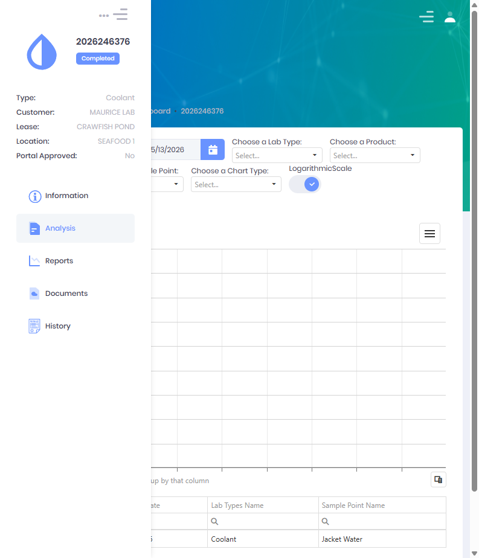
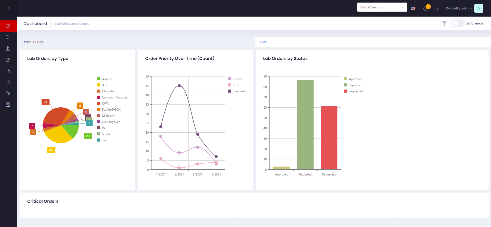

# Lab Analysis

Lab Analysis is how results are reviewed and interpreted over time.  Once results are recorded, Atlas compares values against acceptable limits, charts historical trends, and surfaces exceptions and recommendations so technicians and field personnel can act on the data.

Analysis is available in several places:

* On the **lab order detail** view (per-order results, limits, and trends).
* On the **location** view (multi-result charts for a single well or site).
* On the **User Dashboard** through LIMS analytics widgets.

 

## Order Detail Analysis

Open a lab order (click its **Sample Id** from the [LIMS Management Dashboard](LIMS-Management-Dashboard.md)) and select the **Analysis** tab.  The order detail view has **Information**, **Analysis**, **Reports**, **Documents**, and **History** tabs, with the order summary (Sample Id, status, Type, Customer, Lease, Location) shown on the left.

The Analysis tab plots the order's results as a trend chart and lists the underlying data.

#### Filters
  * **Date** limits the data to a period.
  * **Choose a Lab Type** selects the test category to plot.
  * **Choose a Product** filters by the product being treated.
  * **Sample Point** filters by collection point.
  * **Choose a Chart Type** switches the visualization (line, spline, bar, etc.).
  * **Logarithmic Scale** toggles a log scale on the value axis.

Below the chart, a data grid lists each result with columns such as **Date**, **Lab Types Name**, and **Sample Point Name**, and supports grouping by column for comparison across samples.

> The acceptable **limits** and **out-of-range** status for an order are shown in the **Limits** column on the dashboard grid (a green check for in-range, a red warning for out-of-range) and on the order's **Information** tab.  Limits are resolved by scope (**Location → Lease → Customer → Global**) and, where used, by stream type (Lean/Rich).

 

## Location Lab Analysis

The **Location** view includes a lab analysis chart for reviewing many results from a single location at once, using the same chart filters (date range, lab type, product, sample point, chart type) to compare measurements over time.

 

## Dashboard Widgets

The [User Dashboard](../Tutorials/User-Dashboard-Edit.md) offers a set of LIMS analytics widgets that can be added and arranged to suit each user.  These widgets summarize lab activity and results across the operation, for example:

| Widget | Shows |
|--------|-------|
| Orders by Type / Status / Priority | Counts of lab orders grouped by category |
| Critical Orders | Open orders flagged critical |
| Turnaround by Type | Average time from request to report |
| Failure Rate / Failure Type | Out-of-limit result trends |
| Corrosion Scale | Corrosion-related measurements |
| Well Tests | Well test results |
| CWA Results | Latest CWA analytical results |
| Chart / Grid | Configurable result chart and grid |

 

## Exceptions & Recommendations

Analysis is driven by the limits and conditions configured in [Setup](Setup.md):

* **Limits** define the acceptable range for each field.  A value outside its range is flagged as an exception on the order.
* **Limit Conditions** are formula-based rules that, when met, attach a **recommendation** (for example a treatment adjustment) to the result.

Orders carrying exceptions are highlighted so they can be prioritized for review.

 

## Permissions

Access to Lab Analysis features requires the following permissions:

| Display Name | Description |
|--------------|-------------|
| Lab Orders | View orders and their results |
| Lab Reports | View recorded results |
| Lab Samples | View sample-level result data |
| Field Type Limits | View applicable limits used in comparisons |

## Related Documentation

* [Create Lab Results](Create-Lab-Results.md) - Entering the values analyzed here
* [Setup](Setup.md) - Configuring limits, conditions, and field types
* [Reporting](Reporting.md) - Generating result reports
* [LIMS Management Dashboard](LIMS-Management-Dashboard.md) - Order management

