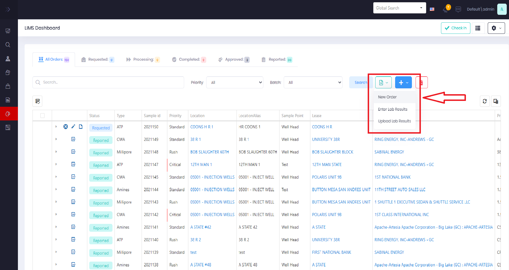
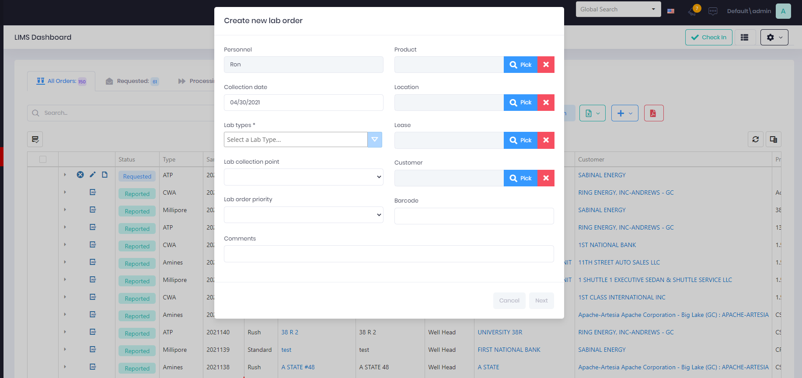

# Lab Orders

Lab Orders are request for testing made by Service Technician, Account Managers, Business Managers, or Lab Technicians.

## Create a new Lab Order

#### Lab Technicians

Lab Technicians with access to the LIMS Management Dashboard can create and manage every function of a Lab Order in the dashboard.

Select the + menu to open the create form.

#### Service Tech or Managers

### Create New Lab Order Form

* Fields
  * **Personnel** is readonly and inherited from the user submitted the form.  This personnel is saved as the requestor and will receive the final lab sample results report(s).
  * **Collection Date** is the date the sample was collect in the field.  Clicking the date opens the date picker and allows the user to select a previous day.
  * **Lab Types** are a collection of types of test to perform on sample.  A single selection is recommended unless the sample can be tested for multiple test types with 1 instrument.
  * **Lab Collection Point** is the point or location the sample was taken from.  Example:  Well Head
  * **Lab Order Priority**  is the urgency of the test and results reporting.  Example:  Standard (5 - 7 Days), Rush (1 - 3 Days), Critical (1 Day)
  * **Product** is the current product, if any, being treated at that well or location the sample was taken.
  * **Location**  is the injection point or well the sample was taken from.
  * **Lease**  is the name area or deed by which a landowner authorizes production of oil and gas.
  * **Customer**  is the party orcompany that owners the land and leases.
  * **Barcode** is a alphnumeric string that is read from label on testing tube, rod, or container and used to uniquely and quickly identifiy the lab order.
  * **Comments** are notes about the sample taken and its environment.

The **Save** button will highlight when all required fields are set.  Saving will add order to the grid list and assign it the next incremental Sample Id.  Typically a numeric identifier containing the year and number of lab order request for that calendar year.