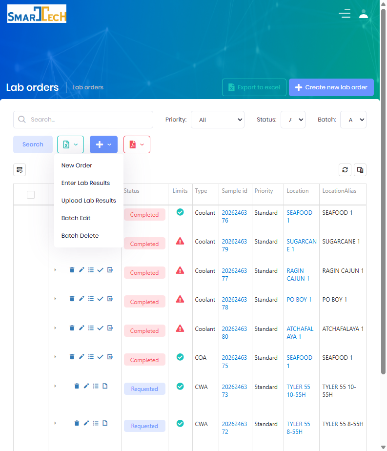
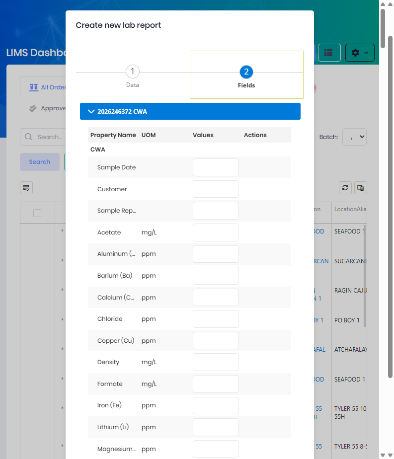

# Lab Results

Lab Results are the analytical values produced when a sample is tested.  Results are recorded against a [Lab Order](Create-Lab-Order.md) and are entered as a **Lab Report**, either by typing values manually or by [importing](Imports-Lab-Results.md) a spreadsheet from the testing lab.

 

> Atlas distinguishes between two kinds of data on an order:
> * **Input data** – measurements collected in the field at sample time, captured on the [Create Lab Order](Create-Lab-Order.md) form.
> * **Output data (results)** – the analytical values produced by testing, captured here as a Lab Report.

 

## Create a new Lab Report

Lab Technicians with access to the [LIMS Management Dashboard](LIMS-Management-Dashboard.md) enter results from the grid.  The **+** (Add) toolbar menu offers **New Order**, **Enter Lab Results**, **Upload Lab Results**, **Batch Edit**, and **Batch Delete**.  You can also use the **Results** action on an individual order row.

Choosing **Enter Lab Results** (or a row's **Results** action) opens the **Create new lab report** form.

The form is a two-step wizard with a **Data** tab and a **Fields** tab.

### Step 1 — Data

#### Fields
  * **Lab Agency** is the laboratory that produced the results.  *(Required.)*  Choose from the configured lab agencies.
  * **Name** is a label for the report.
  * **Lab Orders** is the set of orders the results apply to.  Search for an order or pick it from the lookup; selected orders appear in the grid showing Status, Type, Sample Id, Location, Lease, Customer, Product, and Collection Date.

When entering results from a file instead of typing them, the **Data** tab also exposes import options — an **Import Type** picker (the [Import Type](Setup.md) describing the file layout) and a **Create Lab Orders** checkbox (which creates orders for samples that have no matching order).  See [Import Lab Results](Imports-Lab-Results.md).

Select **Next** to continue to the **Fields** tab.

### Step 2 — Fields (Enter Result Values)

Each selected lab order appears as an expandable panel headed by its **Sample Id** and **Lab Type**.  Within each panel the result fields are grouped and listed with:

| Column | Description |
|--------|-------------|
| **Property Name** | The field/analyte being recorded (for example Iron, Chloride, pH). |
| **UOM** | The unit of measurement for the value. |
| **Values** | The entry control (text, number, checkbox, list, or date depending on the field's data type). |
| **Actions** | A **Calculate** action for calculated fields. |

Fields configured as **calculated** can be derived from their formula using the **Calculate** action on that row, or **Calculate All** to recompute every calculated field at once.

Select **Save** to record the results.

 

## Completion, Limits & Approval

When results are saved, Atlas evaluates the order:

* **Completeness** – every required and calculated output field for each lab type on the order must have a value.  Missing values flag the order with exceptions.
* **Calculations** – calculated fields are computed from their formulas (using product factors and molecular weight where applicable).
* **Limits** – values are checked against the configured [Field Type Limits](Setup.md).  Out-of-range values are flagged, and any matching limit conditions attach recommendations.
* **Status** – depending on the lab type, a complete order moves to **Approved** (or **Completed** when approval is required) or remains incomplete until the missing data is entered.  See the [status flow](Index.md).

> Orders with missing or out-of-range output data are marked with an exception indicator so lab technicians can quickly find work that needs attention.

 

## Uploading an External Results Report (PDF)

When a lab returns a finished PDF report rather than raw data, use the **Upload Lab Results** action to attach the report directly to one or more orders.  See [Reporting](Reporting.md) for details.

#### Fields
  * **Report Type** is the kind of report being uploaded.
  * **Name** is a label for the report. *(Required.)*
  * **Description** is optional notes.
  * **File** is the PDF (or PDFs) to attach.
  * **Lab Orders** is the grid of orders the report is attached to.

 

## Editing Results

Existing results can be reopened from the order or the lab report list and edited with the appropriate permission.  Editing a **reported** order requires the override permission.

 

## Permissions

Access to Lab Results features requires the following permissions:

| Display Name | Description |
|--------------|-------------|
| Lab Reports | View lab reports |
| Create Lab Reports | Enter results, import results, and upload report files |
| Edit Lab Reports | Modify existing lab reports |
| Delete Lab Reports | Remove lab reports |
| Lab Samples | View sample result records |
| Create Lab Samples | Create sample records |
| Edit Lab Samples | Modify sample values |
| Edit Lab Orders | Update the related lab order |
| Edit Override Lab Orders | Edit results on reported orders |

**Related Permissions:**

| Display Name | Description |
|--------------|-------------|
| Lab Agencies | View laboratories producing results |
| Field Types | Field/analyte definitions |
| Field Type Limits | Acceptable result ranges |

## Related Documentation

* [Create Lab Order](Create-Lab-Order.md) - Requesting a test
* [Import Lab Results](Imports-Lab-Results.md) - Importing results from a spreadsheet
* [Analysis](Analysis.md) - Reviewing results, limits, and trends
* [Reporting](Reporting.md) - Generating and distributing result reports
* [Setup](Setup.md) - Configuring field types and limits
* [LIMS Management Dashboard](LIMS-Management-Dashboard.md) - Managing orders and results

