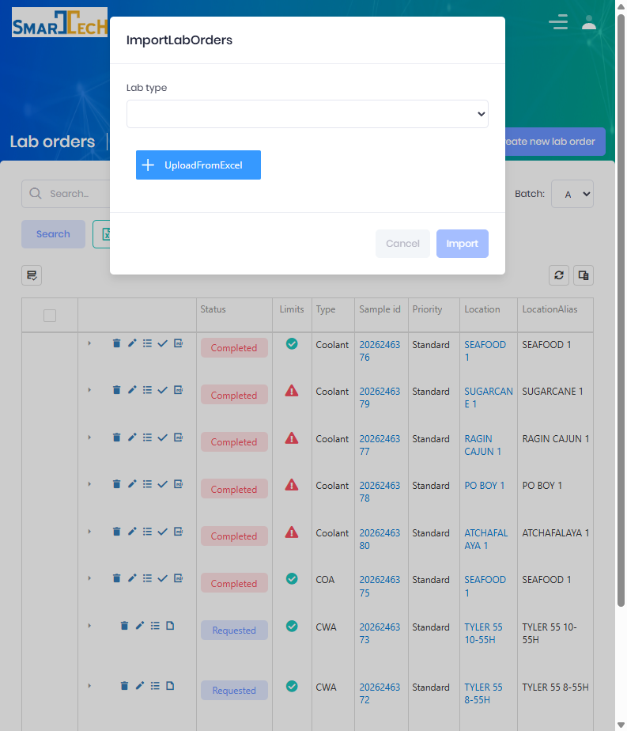

# Import Lab Orders

Lab Orders can be created in bulk by importing a spreadsheet instead of entering each order by hand.  This is useful when a batch of samples is collected together or when orders originate from an external system.

Importing is available from the **Imports** button on the [LIMS Management Dashboard](LIMS-Management-Dashboard.md) toolbar.

 

## Import an Order File

Select **Imports** to open the **Import Lab Orders** form.

#### Fields
  * **Lab Type** is the test category applied to every order in the file. *(Required.)*
  * **Upload from Excel** opens the file picker.  Accepted formats are **.csv**, **.xls**, and **.xlsx** (up to 10 MB).

After choosing the **Lab Type** and a file, select **Import**.  The file is processed in the background and the new orders appear on the dashboard when finished.

> The **Import** button is enabled only after both a Lab Type and a file have been selected.

 

## File Layout

The spreadsheet is read using a **Lab Import Type** configured in [Setup](Setup.md).  The import type defines the header row, the data row range, and the column mapping that connects each spreadsheet column to a field.

#### Standard columns
The importer resolves these values from the mapped columns:

| Column | Notes |
|--------|-------|
| **Location Code** | Matches an existing location. |
| **Lease Name** | Matches an existing lease. |
| **Customer / Customer Name** | Matches an existing customer. |
| **Collection Date** | The date the sample was collected. |
| **Lab Collection Point** | Required when the lab type requires a collection point. |
| **Lab Order Priority Name** | Defaults to **Standard** when omitted. |
| **Personnel Name** | Defaults to the importing user's personnel when omitted. |
| **Product Name** | Validated against the products/lab type products. |
| **Field columns** | Any additional mapped columns are stored as the order's input data. |

> The exact column headers and positions are defined by the selected Lab Import Type.  Where a template download is enabled for the import type, start from that template to ensure the columns line up.

 

## Validation & Results

* Rows are validated as they are read.  Rows that fail validation (for example an unknown location, lease, customer, or product) are skipped and collected into an **invalid orders** export so they can be corrected and re-imported.
* Valid rows create lab orders with the selected lab type.  Each new order is assigned its next Sample Id and follows the normal [status flow](Index.md) — orders with complete required input move to **Requested**, otherwise they remain in **Draft**.
* Progress and any errors are recorded in the background job logs.

 

## Permissions

Access to import Lab Orders requires the following permissions:

| Display Name | Description |
|--------------|-------------|
| Lab Orders | View lab orders |
| Create Lab Orders | Create orders (required to import) |
| Lab Import Types | Configure the import format |

**Related Permissions:**

| Display Name | Description |
|--------------|-------------|
| [Locations](../AreaManagement/Locations.md) | Resolve location codes |
| [Customers](../AreaManagement/Customers.md) | Resolve customer names |
| [Products](../Product/Products.md) | Resolve product names |

## Related Documentation

* [Create Lab Order](Create-Lab-Order.md) - Creating a single order manually
* [Import Lab Results](Imports-Lab-Results.md) - Importing test results
* [Setup](Setup.md) - Configuring import types and column mapping
* [LIMS Management Dashboard](LIMS-Management-Dashboard.md) - Order management

