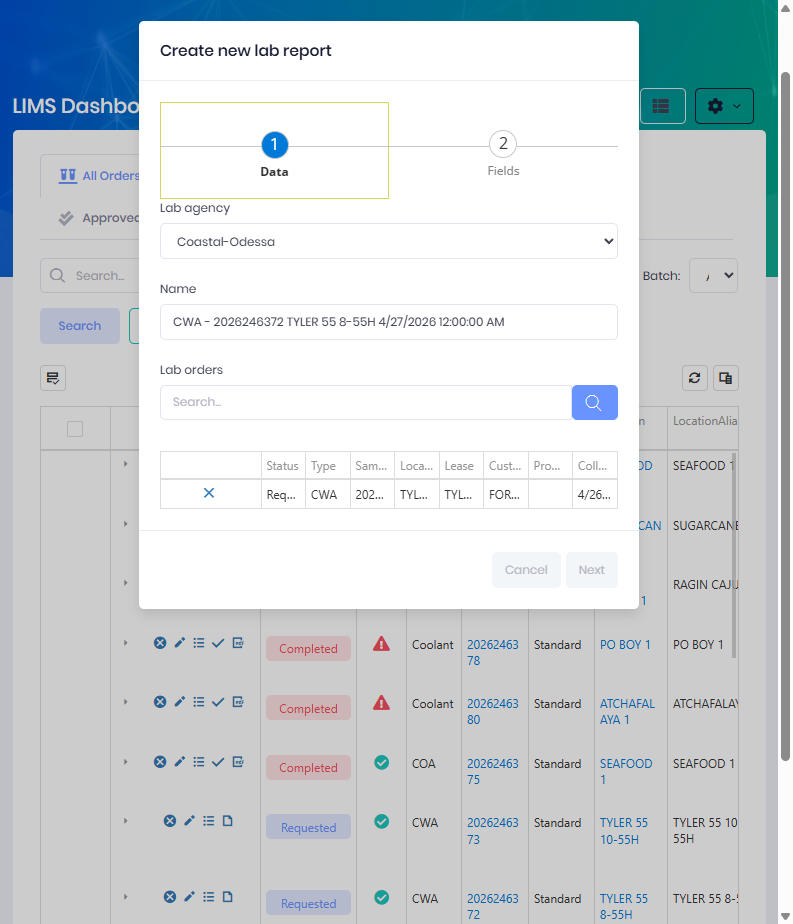

# Import Lab Results

Lab Results returned by a testing laboratory can be imported from a spreadsheet rather than entered by hand.  Atlas reads the file, matches each sample to its lab order, records the analytical values, and runs the usual completeness, calculation, and limit checks.

Importing results is done through the **Lab Report** form.  See [Create Lab Results](Create-Lab-Results.md) for the manual-entry path.

 

## Import a Results File

From the [LIMS Management Dashboard](LIMS-Management-Dashboard.md), open the **+** (Add) menu and choose **Enter Lab Results** to open the **Create new lab report** form, then select an **Import Type** and a file on the **Data** tab instead of typing values.

#### Fields
  * **Lab Agency** is the laboratory that produced the results. *(Required.)*
  * **Name** is a label for the report.
  * **Import Type** is the [Lab Import Type](Setup.md) describing the file layout. *(Required for import.)*  Use **Pick** to select it.
  * **Create Lab Orders** automatically creates lab orders for any sample in the file that does not already have a matching order.
  * **File** is the results spreadsheet.  Accepted formats are **.csv**, **.xls**, and **.xlsx** (up to 10 MB).

After selecting the import type and file, save the report to process the import.

 

## File Layout

The selected **Lab Import Type** controls exactly how the file is read.  Three parsing modes are supported:

| Mode | When used |
|------|-----------|
| **Column per field** | Standard layout — each column maps to a field, and the **Id Column** identifies the sample.  Columns are mapped via the **Fields** configuration on the import type. |
| **Key / value pair** | The file lists field names and values in rows.  The import type's **Key Field**, **Value Field**, and **Id Field** identify them. |
| **Advanced** | Non-standard layouts (multiple sheets, fixed column positions, combined key/value) handled via the import type's **Advanced Options** JSON. |

Key settings on the import type:
  * **Header Row** — the row containing column headers.
  * **Start Row / End Row** — the range of data rows to read.
  * **Id Column** — the value used to match each sample to its lab order.
  * **Delimiter** — for CSV files (comma, semicolon, tab, or pipe).

> Where the import type allows a template download, start from that template so the columns align with the expected layout.

 

## Matching, Calculation & Status

After the file is read:

* **Matching** – samples are matched to existing lab orders using the **Id Column**.  When **Create Lab Orders** is enabled, unmatched samples generate new orders.
* **Completeness** – each order is checked for all required and calculated output fields.  Missing values flag the order with exceptions.
* **Calculation** – calculated fields are computed from their formulas.
* **Limits** – values are checked against the configured [Field Type Limits](Setup.md); out-of-range results are flagged and any limit conditions attach recommendations.
* **Status** – complete orders advance to **Approved** or **Completed** (depending on the lab type's approval setting); incomplete orders retain their exception flag. See the [status flow](Index.md).
* **Reports** – result PDFs can be generated automatically following import.

 

## Scheduled Imports

The Lab Report form also supports scheduled imports, allowing a recurring results file (for example a nightly drop from an external lab) to be picked up on a defined schedule with a repeat interval and day-of-week selection.

 

## Permissions

Access to import Lab Results requires the following permissions:

| Display Name | Description |
|--------------|-------------|
| Lab Reports | View lab reports |
| Create Lab Reports | Import results and create reports |
| Lab Samples | View imported sample data |
| Create Lab Samples | Create sample records during import |
| Lab Import Types | Configure the import format |
| Create Lab Orders | Required when "Create Lab Orders" is used |

**Related Permissions:**

| Display Name | Description |
|--------------|-------------|
| Lab Agencies | Select the producing laboratory |
| Field Types | Field/analyte definitions |
| Field Type Limits | Limits applied after import |

## Related Documentation

* [Create Lab Results](Create-Lab-Results.md) - Entering results manually
* [Import Lab Orders](Imports-Lab-Order.md) - Importing orders in bulk
* [Setup](Setup.md) - Configuring import types and column mapping
* [Analysis](Analysis.md) - Reviewing imported results
* [LIMS Management Dashboard](LIMS-Management-Dashboard.md) - Order management

