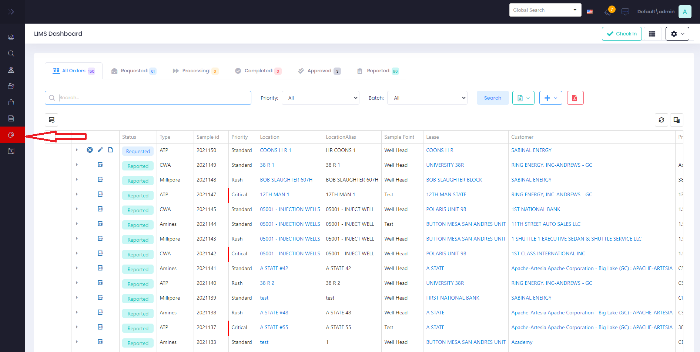

# Lab Information Management System (LIMS)

## Status Flow

* [Draft](LabOrderStatus/Draft-Lab-Order.md) Inital Lab Order is created on Mobile and awaiting final input numbers.
* [Requested](Create-Lab-Order.md) Lab Request and Sample created and turned into Lab Technician for review.
* [Processing](LabOrderStatus/CheckIn-Lab-Order.md) Lab Request for testing checked-in and approved by Lab Technician.
* [Completed](LabOrderStatus/Complete-Lab-Order.md) Lab Request test completed, result data entered, and awaiting Lab Technician approval.
* [Approved](LabOrderStatus/Approve-Lab-Order.md) Lab Request data approved by Lab Technician.
* [Reported](LabOrderStatus/Report-Lab-Order.md) Lab Request Result data reports available and sent to Service Tech and Account Manager.
* [Cancelled](LabOrderStatus/Cancel-Lab-Order.md) Lab Request for testing cancelled by the Lab Technician or requesting Service Tech/Account Manager.

[Glossary](Glossary.md) of terms used within the LIMS system.

## LIMS User Dashboard
The [User Dashboard](../Tutorials/User-Dashboard-Edit.md) comes with a varity of LIMS Widgets that can be customized to what is important to you.

## LIMS Management Dashboard
The [LIMS Management Dashboard](LIMS-Management-Dashboard.md) is used by lab technicians and admins to process request and approve results through desired workflow.

