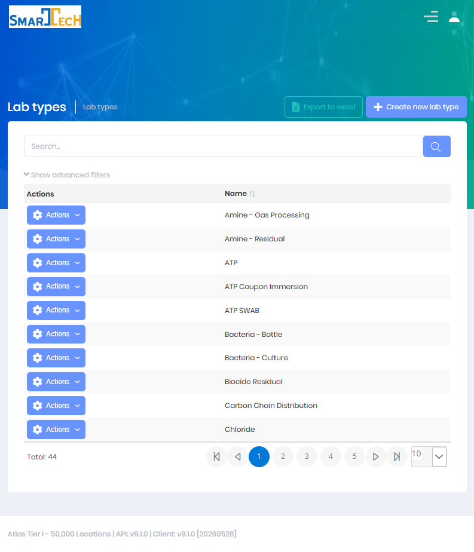
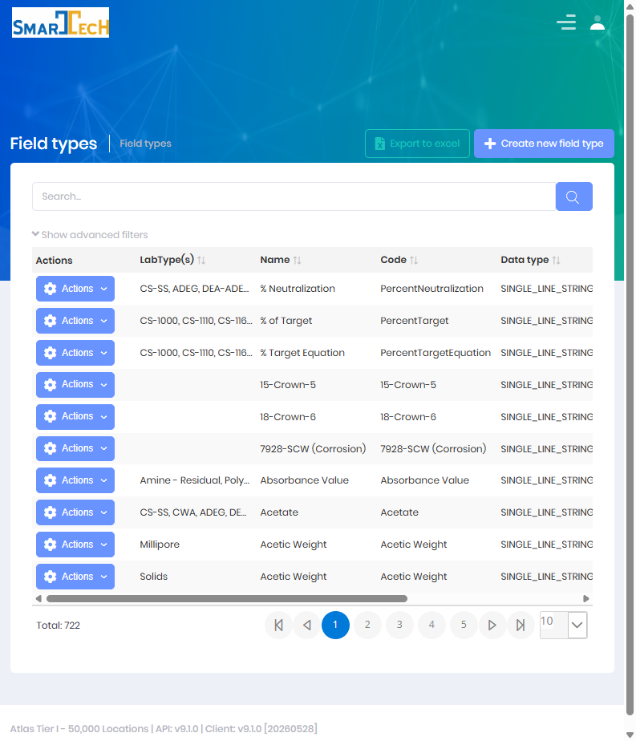
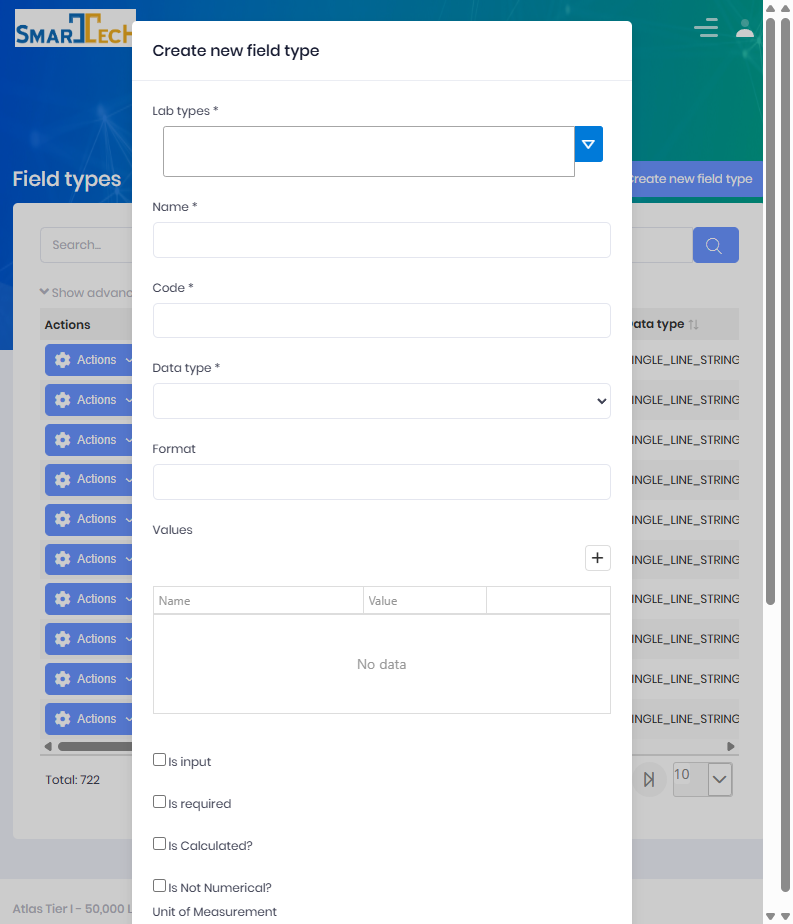
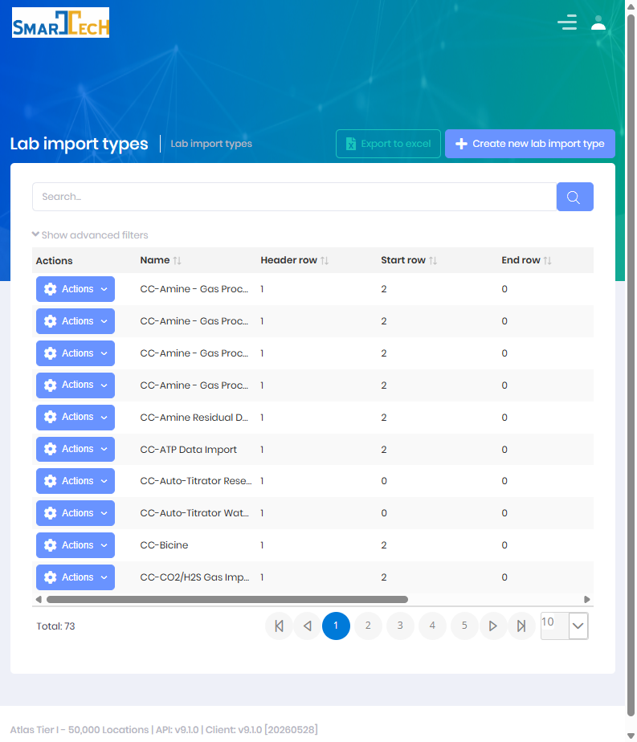

# Lab Information Management System (LIMS)

## Setup

LIMS Setup is where lab technicians and administrators configure the building blocks that drive the lab workflow:  the kinds of tests offered, the data captured for each test, how external results are imported, and the acceptable limits used to flag exceptions.

Setup is reached from the **Settings/Setup** button on the [LIMS Management Dashboard](LIMS-Management-Dashboard.md) or from the LIMS menu.

 

> Most setup items are configured once and reused across every lab order.  Changes to Field Types, Lab Types, and Limits affect how new and existing orders are validated, calculated, and reported.

 

## Lab Types

**Permission:** `Pages.LabTypes.Create`

A **Lab Type** is a category of test performed on a sample (for example *Water Analysis*, *Corrosion*, *Bacteria*).  A single lab order can include one or more lab types.  Each lab type controls which fields are collected, how results are reported, and the approval behavior.

#### Fields
  * **Name** is the display name of the test.
  * **Report Type** is the internal PDF report generated for results of this type.
  * **External Report Type** is the customer-facing report, when results are reported externally.
  * **Lab Order Status** is the status a new order receives once its required input is complete.
  * **Require Product** forces a product selection on orders of this type.
  * **Require Barcode** forces a barcode value on orders of this type.
  * **Is Collection Point Required** forces a lab collection point on orders of this type.
  * **Allow Input Attachments** lets users attach files in place of typed input values.
  * **Is Approval Required** routes completed results to a lab technician for approval before they are reported.
  * **Is Externally Reported** indicates results are produced and returned by an outside lab.
  * **Is Active** controls whether the lab type is available for selection.
  * **Molecular Weight** is used by calculated field formulas where applicable.

#### Field Assignment
Each lab type is linked to the **Field Types** it collects through the lab type setup screen.  For every assigned field you control its **order** and whether it is **required** for that lab type.  Fields can be marked as **input** (collected in the field) or **output** (analytical results), and the required/calculated flags determine when an order is considered complete.

 

## Field Types

**Permission:** `Pages.FieldTypes.Create`

A **Field Type** defines a single measurement or data point captured on a lab order or result (for example *Iron*, *Chloride*, *pH*, *Water Content*).  Field Types are the reusable definitions that lab types draw from.

#### Fields
  * **Code** is the unique key used to store the value (this key is matched on import).
  * **Name** is the display label shown to users.
  * **Data Type** controls the input control used to capture the value (the on-screen options are shown in parentheses):
    * **Text Input** – short free text *(single line string)*
    * **Text Area Input** – long free text *(multi line string)*
    * **Checkbox** – true/false
    * **Combobox** – single choice from a defined list
    * **Multi Select Combobox** – multiple choices from a defined list
    * **Datetime Picker** – a date/time value
  * **Values** is the list of options used by combobox data types.
  * **Unit of Measurement** is the unit displayed next to the value (for example *ppm*, *mg/L*).
  * **Format** controls numeric/display formatting.
  * **Is Input** marks the field as collected during sample collection (versus an analytical output result).
  * **Is Calculated** marks the field as derived from a formula rather than entered directly.
  * **Formula** is the expression used to calculate the field value.
  * **Is Required** marks the field as mandatory.
  * **Is Non Numerical** indicates the value is not used in numeric limit checks or trends.
  * **Order** controls the display sequence.
  * **Parent Group** groups related fields together on entry and reporting screens.

The create/edit form for a field type:

 

## Import Types

**Permission:** `Pages.LabImportTypes.Create`

A **Lab Import Type** defines how a spreadsheet from an external lab (or an internal upload) is read and mapped into Atlas.  Each external lab format typically has its own import type.

#### Fields
  * **Name** is the display name of the import format.
  * **Header Row** is the row number that contains column headers.
  * **Start Row** / **End Row** define the range of data rows to read.
  * **Id Column** is the column that uniquely identifies each sample (used to match samples to lab orders).
  * **Delimiter** is the separator used for CSV files (comma, semicolon, tab, or pipe).
  * **Exclusions** lists values or rows to skip during import.
  * **Allow Template Download** enables a downloadable template for this format.
  * **Is File Key Value Pair** switches parsing to a key/value layout instead of one column per field.
    * **Key Field** identifies the column holding the field name.
    * **Value Field** identifies the column holding the value.
    * **Id Field** identifies the column holding the sample id.
  * **Advanced Options** holds JSON configuration for non-standard layouts (multiple sheets, fixed column positions, combined key/value).

#### Column Mapping (Fields)
For standard column-per-field formats, each spreadsheet column is mapped to a **Field Type** using the **Fields** configuration.  The **Order** is the column position and the mapping connects the column to the field that stores the value.

 

## Fields (Column Mapping)

**Permission:** `Pages.Fields.Create`

**Fields** are the column maps that tie a spreadsheet column (on an Import Type) or an export column (on an Export Template) to a **Field Type**.

#### Fields
  * **Field Type** is the measurement the column maps to.
  * **Order** is the column index/position.
  * **Header Name** is the expected column header text.
  * **Value** / **Format** / **Width** / **Alignment** control how the column is read or rendered.
  * **Lab Import Type** associates the mapping with an import format.
  * **Lab Export Template** associates the mapping with an export format.

 

## Limits & Conditions

Limits flag results that fall outside acceptable ranges and can trigger recommendations.

| Setup Item | Permission | Purpose |
|------------|------------|---------|
| **Field Type Limits** | `Pages.FieldTypeLimits.Create` | Acceptable ranges for a field, optionally scoped by location, lease, customer, or stream type (Lean/Rich). |
| **Field Type Limit Conditions** | `Pages.FieldTypeLimitConditions.Create` | Formula-based conditions that, when triggered, attach a recommendation to the result. |
| **Customer Field Type Limits** | `Pages.CustomerFieldTypeLimits.Create` | Customer-specific overrides of the standard limits. |
| **Lab Type Products** | `Pages.LabTypeProducts.Create` | Product factors used in calculated field formulas. |

> Limits are resolved from the most specific scope to the most general:  **Location → Lease → Customer → Global**.

 

## Administration Lookups

Some setup values are maintained at the administration level (under **Administration → LIMS**).  See [LIMS Lookups](Lookups.md) for the full list.

| Lookup | Permission |
|--------|------------|
| Lab Order Priorities | `Pages.Administration.LabOrderPriorities.Create` |
| Lab Collection Points | `Pages.Administration.LabCollectionPoints.Create` |
| Lab Agencies | `Pages.LabAgencies.Create` |
| Lab Export Templates | `Pages.LabExportTemplates` |

**Lab Order Priorities** are defined with a target turnaround (duration in days).  The standard values are:

| Priority | Target Turnaround |
|----------|-------------------|
| N/A | 0 (no target) |
| Critical | 1 day |
| Rush | 3 days |
| Standard | 7 days |

> The dashboard priority filter also includes a computed **Overdue** option for orders past their target turnaround.

**Lab Order Status** is a system-defined list (not an editable lookup): **Not Received, Draft, Requested, Processing, Completed, Approved, Reported, Rejected, Cancelled**.  See the [status flow](Index.md).

 

## Permissions

Access to LIMS Setup features requires the following permissions:

| Display Name | Description |
|--------------|-------------|
| Lab Types | View and configure lab test types |
| Field Types | Define measurements/analytes captured on orders |
| Fields | Map import/export columns to field types |
| Field Type Lab Types | Associate fields with lab types |
| Lab Import Types | Configure external result import formats |
| Field Type Limits | Define acceptable result ranges |
| Field Type Limit Conditions | Define conditional recommendations |
| Customer Field Type Limits | Define customer-specific limit overrides |
| Lab Type Products | Link products and factors to lab types |
| Lab Export Templates | Configure export formats |

## Related Documentation

* [LIMS Lookups](Lookups.md) - Reference data and lookup tables
* [Create Lab Order](Create-Lab-Order.md) - Creating lab test orders
* [Create Lab Results](Create-Lab-Results.md) - Entering test results
* [Import Lab Results](Imports-Lab-Results.md) - Importing results from external labs

