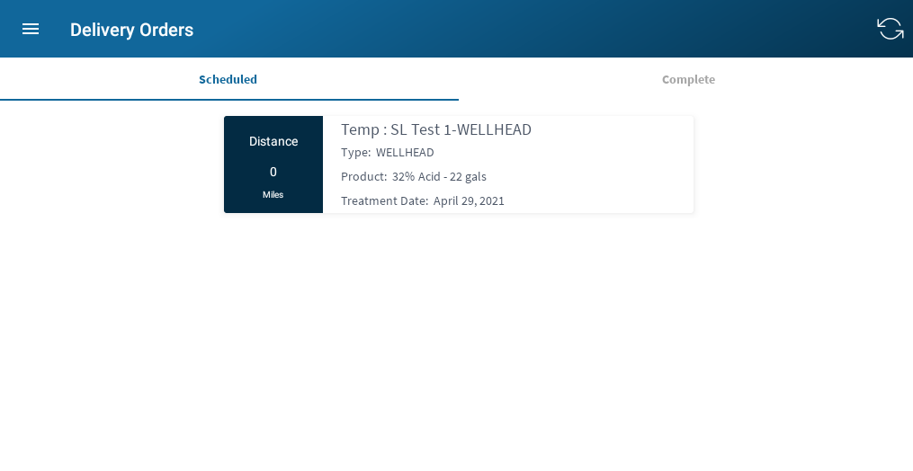

# Delivery Orders

The delivery orders sections is laid out using two tabs. The first tab 
contains a list of scheduled delivery orders for a specific user. The second tab is 
a list of completed deliveries in the last 24hrs. Selecting an order will bring up a 
list of actions. The first action would be to complete the treatment, filing in the form
with the amount of product delivered. The second option is to add an 
exception, if for some reason the delivery was unable to be completed. 
The last option is to view the locations details. 

### View

##### Actions

* Sync Mobile Data and Refresh
* Select Delivery Order

