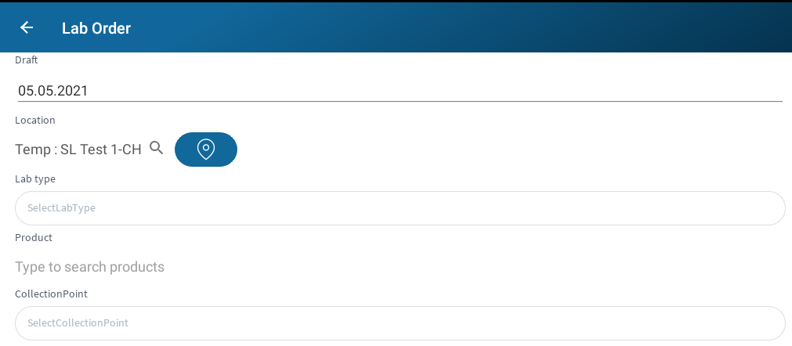
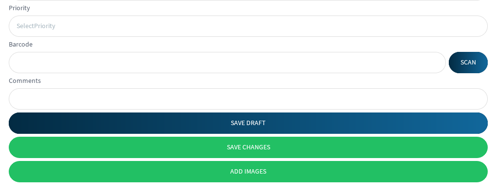

# Lab Order

The lab order form allows user to submit new lab orders from the field. The first 
item to complete is the **date**, which is recorded as the sample date. If you collected 
the sample at a different time from today, you are allowed to change it. Next 
is the **location**. If the user is coming from the sampling map, this should
already be filled in according to the selected location. If starting from the
lab orders view, the user can either type in the location or use the map 
button to show a map at your current location. If using the map, you will need
to select the pin for the correct location. Once the location and date are set,
you will need to fill out the **lab type**. Depending on the lab type, additional 
fields will be added to the form to complete later. Next is the **product** that
is being used to test, and it may or may not be required based on the lab type.
Once the product is set, you can include the **collection point** of the well. The **priority**
must be set in order to let the technicians know the amount of time needed
to receive results. The next field is this samples **barcode**, which can either be typed in
or scanned. The barcode will allow technicians to quickly identify your sample as it comes
into the lab. **Comments** can be included if needed, as well as **images**. Saving can be 
done as either a draft, which will allow edits at a later date, or simply saved and submited 
for lab testing.

 
### View

##### Actions

* Find Location
* Scan Barcode
* Save Draft
* Add Images
* Save

