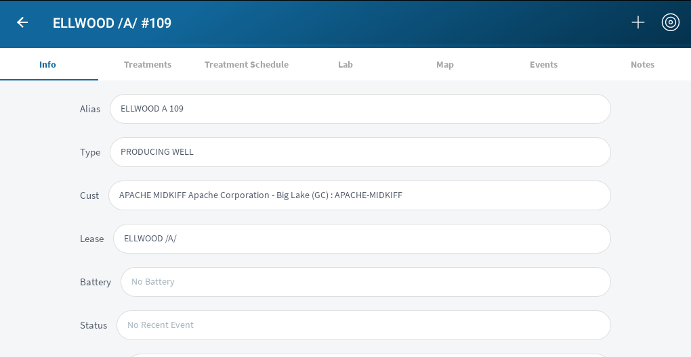

# Location View

This view will show all of the information for a given location. From here you 
can see the treatment data, treatment schedules, any lab orders, the 
actual position on the map, and events, and finally all of the notes.

### View

##### Actions

* Add New Lab Order
* Add New Event (Failure)
* Add New Note

* Readjust gps       

