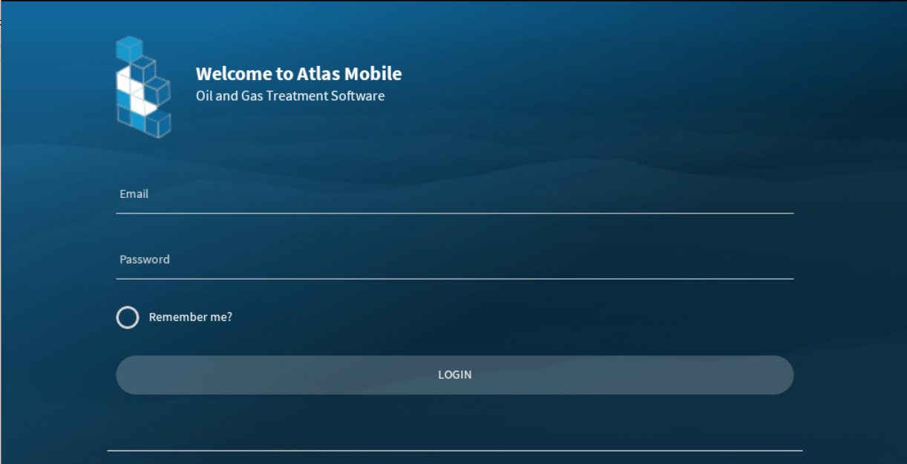

# Login

The app requires a user to log in. The login is determines what data is available for a given user using the assigned users roles.

Login login screen below, requires an email and a password. Enter the user name and password, and then click login. If you've enter 

the information correctly you will be directed to the main [dashboard](Mobile/Dashboard.md). The app needs to download its initial data set, 

so it will automatically start a data sync in the background. Please wait to navigate until the sync has completed. 

