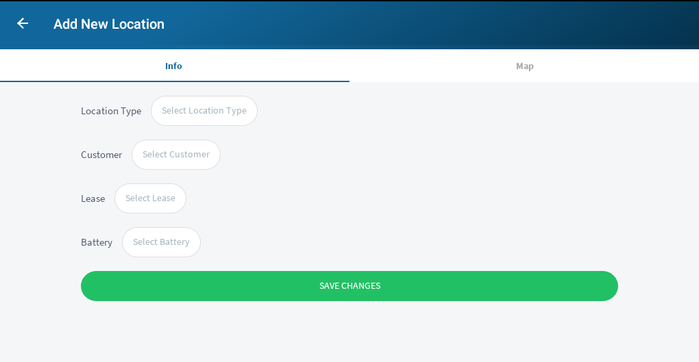
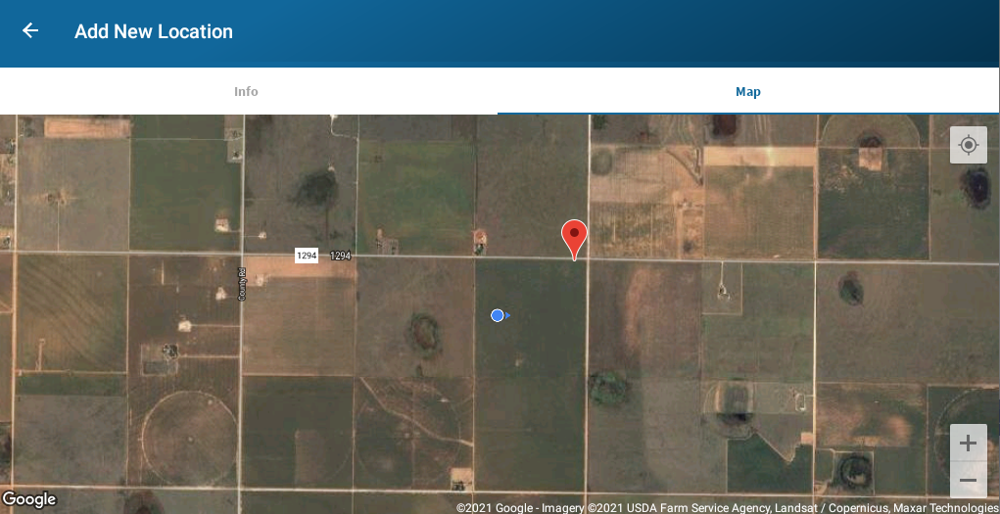

# New Location

When adding a new location you will need to fill out some basic information. Required
fields include the location type, customer, and lease. The battery is listed but 
not required. Once these are filled in, use the map to make sure that the new location
is correctly placed on the map. If you need to move the location, simply tap on the map
and the pin we relocate.

### Form

##### Actions

* Save New Location

