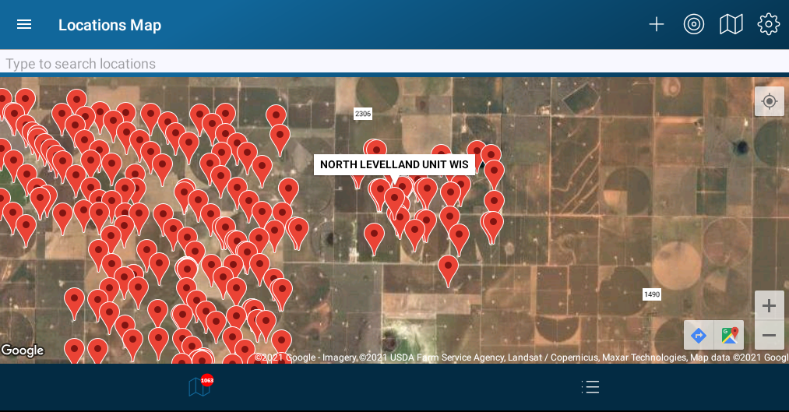

# Sampling Mode

In this mode the map will allow a user to

### Map

##### Actions

* Add New Location
* Center Map On Current Location
* Change Map Type (Street, Satelite, Hybrid)
* Change Map Type (Treating, Sampling, Discovery)
* Click Map Pin For Location View

