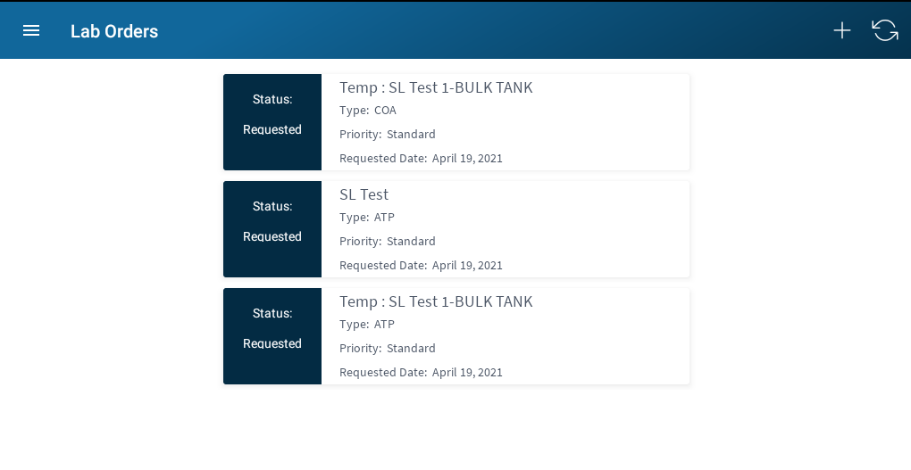

# Lab Samples

This section of the app is used to create and edit lab orders. 
The view will list any lab orders currently being processed. Once they have been reported they will no longer show, and will only be available on 
the web. 

### View

##### Actions

* Add New Lab Order
* Click to Edit
* Sync and Refresh
