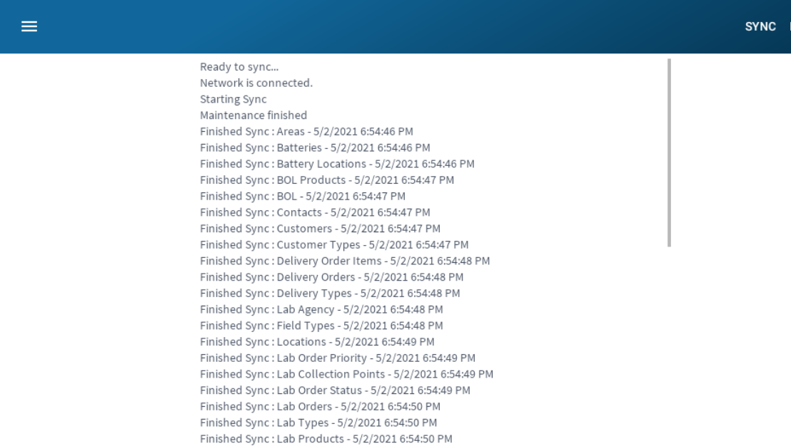

# Sampling

This part of the app allows a user to view a map of locations for scheduled deliveries. Once the map is loaded a pin will show on the map, 
giving you a visual indicator of the location and status.
Green is for locations that have already been treated within the allotted time frame, 
and do not require a treatment. 
Yellow pins indicate that the location will need to be treated in the next few days.
Red pins indicate that the location has a scheduled delivery 
that should occur on that day.

