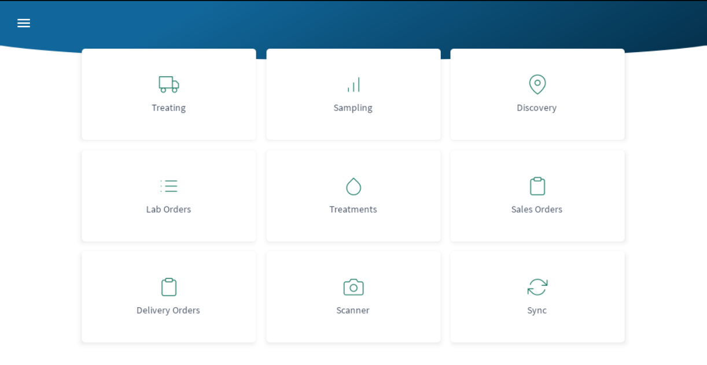

# Dashboard and Menu

The dashboard shows each of the functional areas of the app. From here you can navigate to any area. The menu in the top left corner mirrors the dashboard.

 

* [Treating](Mobile/Treating.md):  Map view for for truck treating.
* [Sampling](Mobile/Sampling.md):  Map view for lab sampling.
* [Discovery](Mobile/Discovery.md):  Map view for seeing all available locations.
* [Lab Orders](Mobile/LabOrders.md):  List of lab ordersw created by a user.
* [Treatments](Mobile/Treatments.md):  Review for any chemical treatments.
* [Sales Orders](Mobile/SalesOrders.md):  List of assigned sales orders.
* [Delivery Orders](Mobile/DeliveryOrders.md):  List of assigned delivery orders.
* [Scanner](Mobile/Scanner.md):  Scan lab order or location tags.
* [Sync](Mobile/Sync.md):  Mobile data sync.