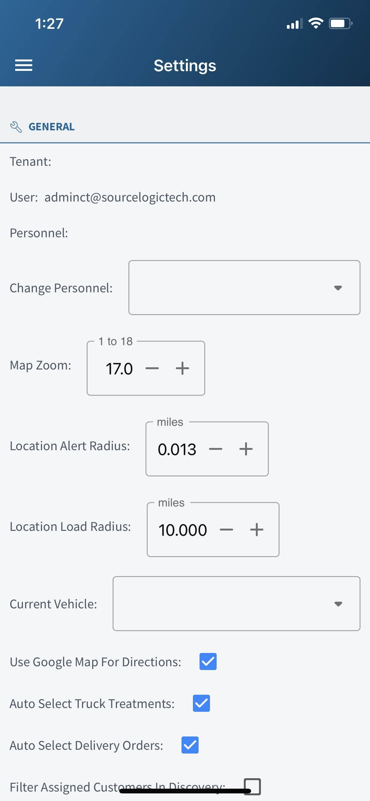
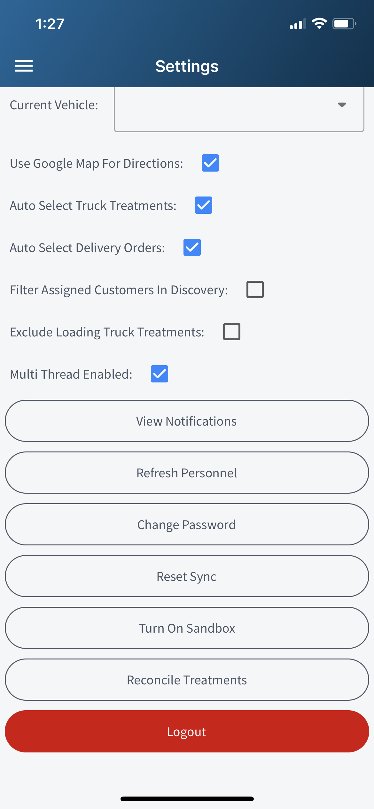

# Settings

Setting for the app inlude the following.

* Company Name
* User Name
* Personnel Name
* Map Zoom : Controls how far to zoom in when the map loads
* Location Alert Radius : Controls how close you need to be to a location for 
the system to alert the user.
* Current Vehicle : Used when creating shipment on mobile. Setting this will auto select a vehicle for new shipments.
* Use Google Map For Direction : When asking for direction to a location, setting this will use google maps if on iphone.
* Auto Select Truck Treatments : Turning this on will popup the treatment form when on site of a truck treating location.
* Auto Select Delivery Orders : Turning this on will popup the order form when on site of a delivery location.
* Filter Assigned Customers in Discovery : Turning this on will filter locations when using the map in discovery mode.
* Exclude Loading Truck Treatmens : This will ensure the sync does not check for truck treating schedules.
* Multi Thread : For devices with cpu's that support multi threading.
* View Notifications : This will check the server live for new notifications.
* Refresh Personnel : Allows the system to check to see if the login was reassigned a personnel user.
* Change Password : Allows the user to change password.
* Turn on sandbox : Sandbox mode, if enabled will allow you to use the app outside of the normal production environment.
* Reconsile Treatments : Used to double check all treatments have been upload.

