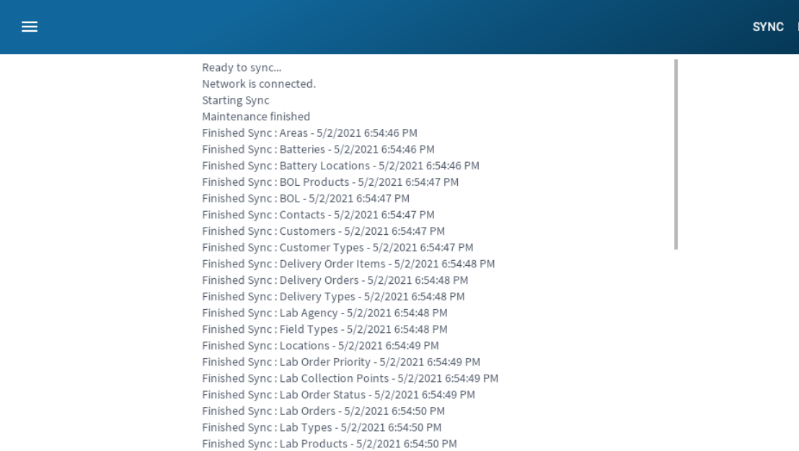

# Data Sync

The app is capable of completing all tasks without internet. In order for this to work, a local copy of the data is stored on the device. 
Syncing of this data is done continously in the background, every 5 minutes. Here you can manually sync the data when needed. 

