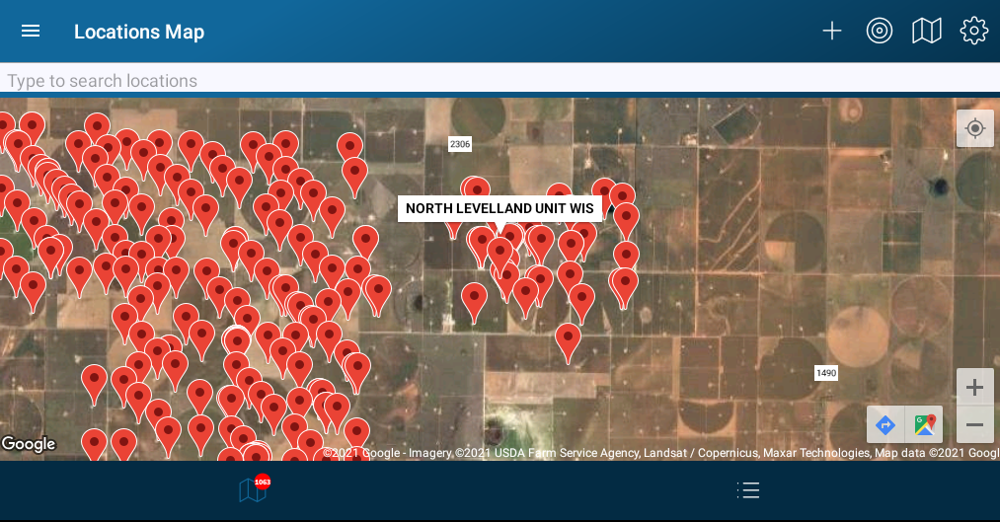

# Truck Treating Mode

This part of the app allows a user to view a map of locations for
 scheduled deliveries. Once the map is loaded pins will show on the map in the , 
giving you a visual indicator of the location and status. The view has two
 tab each show a count. The first tab on the left side, shows your current
 location ,the loaded pins, and various other actions.
 and allow the list of close locations on the second tab.
Green is for locations that have already been treated within the allotted time frame, 
and do not require a treatment. 
Yellow pins indicate that the location will need to be treated in the next few days.
Red pins indicate that the location has a scheduled delivery 
that should occur on that day. 
Moving close to a location will bring up the location view. You may also load 
a location using the search bar.

### Map

##### Actions

* Add New Location
* Search Location 
* Center Map On Current Location
* Change Map Type (Street, Satelite, Hybrid)
* Change Map Type (Treating, Sampling, Discovery)
* Click Map Pin For Location View

