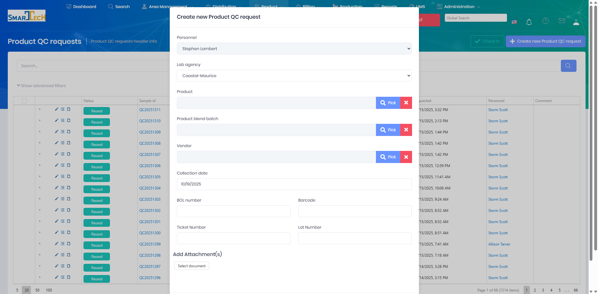

# Lab QC Requests

Lab QC (Quality Control) Requests manage testing and quality assurance for products, particularly for blended products and incoming inventory. This ensures products meet specifications before being used or delivered to customers.

## Overview

The Lab QC Requests page manages quality control testing requests for products. QC requests can be created for blend batches, incoming shipments, or routine product testing to verify specifications.

The Product QC Requests page displays all QC testing requests with:
* **Status badges** - Visual indicators showing test status (Passed shown in green)
* **Sample ID** - Unique identifier for each QC request (e.g., QC20251311)
* **Collected date** - When the sample was collected
* **Product** - Product being tested (e.g., CSW-2565NGL G BULK, PAO-5804 G BULK)
* **BOL** - Bill of Lading number (if applicable)
* **Vendor** - Vendor information
* **Requested date** - When the QC request was created
* **Personnel** - Who requested the test
* **Comment** - Additional notes

### Creating a New QC Request

Click **Create new Product QC request** to open the request dialog:

The Create New Product QC Request dialog includes:
* **Personnel** - Select who is requesting the test
* **Lab agency** - Select the testing laboratory
* **Product** - Pick the product to be tested
* **Product blend batch** - Link to a specific blend batch (optional)
* **Vendor** - Select vendor if testing incoming inventory
* **Collection date** - Date the sample was collected
* **BOL number** - Bill of Lading reference
* **Barcode** - Sample barcode for tracking
* **Ticket Number** - Related ticket or reference number
* **Lot Number** - Manufacturing lot number
* **Add Attachment(s)** - Attach related documents or images

## Key Features

* Create QC testing requests
* Link requests to blend batches or shipments
* Define required tests and specifications
* Track request status through testing
* Record test results and pass/fail status
* Approve or reject products based on QC results
* Quarantine failed products
* Generate QC certificates and documentation
* Maintain QC history and trends

## Permissions

Access to Lab QC Requests features requires the following permissions:

| Display Name | Description |
|--------------|-------------|
| Lab QC Requests | View lab QC request records |
| Create Lab QC Requests | Create new QC requests |
| Edit Lab QC Requests | Modify QC request details |
| Delete Lab QC Requests | Remove QC request records |

**Related Permissions:**

| Display Name | Description |
|--------------|-------------|
| [Blend Batches](ProductBlendBatchs.md) | View blend batches (QC testing subjects) |
| [Products](Products.md) | View products (tested items) |
| [Shipments](Shipments.md) | View shipments (incoming QC testing) |
| [Product Inventory](ProductInventory.md) | Manage inventory (quarantine failed products) |

## Related Documentation

* [Product Blend Batches](ProductBlendBatchs.md) - Blends requiring QC testing
* [LIMS](../LIMS/Index.md) - Lab information management system

