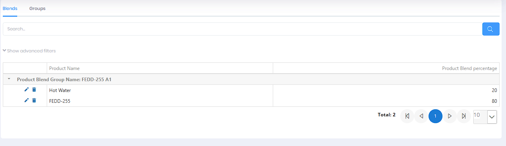
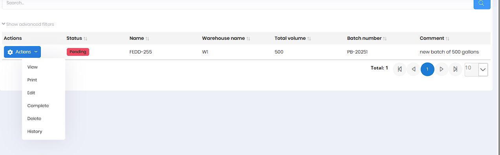
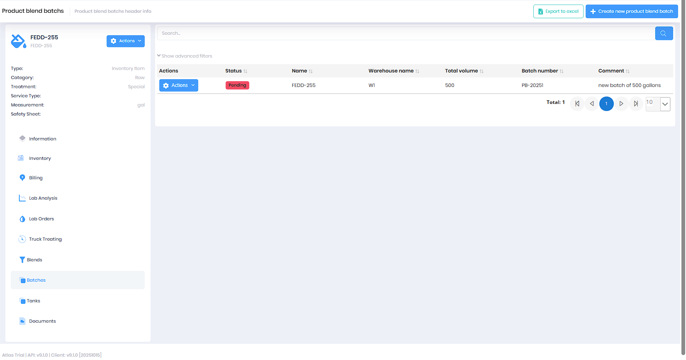

# Blend Batches

Blend Batches track the creation of blended products from component materials. This module records batch formulations, production details, and resulting inventory for custom-blended products. Each batch represents a specific production run using a defined blend formulation.

**Permission:** `Pages.ProductBlendBatchs`

## Overview

The Blend Batches page manages the blending and production of custom products. Each batch records the blend formulation used, warehouse location, total volume produced, batch number, and status. Batches can be accessed from the main Blend Batches page or from individual product detail pages.

*Blend Batches grid showing status, product, warehouse, volume, batch number, and comments*

## Key Features

* Create blend batch records for production runs
* Link batches to predefined blend formulations (Product Blend Groups)
* Record warehouse location and total volume produced
* Automatically generate unique batch numbers for traceability
* Track batch status (Pending, Completed)
* Complete batches to finalize inventory transactions
* Print batch reports for documentation
* View batch history and audit trail
* Export batch data to Excel
* Link batches to quality control testing

## Batch Management

### Creating a New Batch

1. Click **Create New Blend Batch**
2. Select the **Product** (finished blended product)
3. Choose the **Product Blend Group** (formulation to use)
4. Select the **Warehouse** where batch is produced
5. Enter **Total Volume** produced
6. Add optional **Comment** (e.g., "new batch of 500 gallons")
7. Click **Save**

*Dialog for creating a new blend batch*

The system automatically assigns a unique **Batch Number** (e.g., PB-20251).

### Batch Actions

Each batch has an **Actions** menu with the following options:

* **View** - View complete batch details and component breakdown
* **Print** - Generate Product Blend Batch Report
* **Edit** - Modify batch information (for pending batches)
* **Complete** - Finalize batch and update inventory
* **Delete** - Remove batch record
* **History** - View audit log of all changes

### Batch Status

* **Pending** - Batch created, production not yet complete
* **Completed** - Batch finished, inventory updated

### Completing a Batch

When production is finished:

1. Click **Actions** > **Complete**
2. Status changes from "Pending" to "Completed"
3. Inventory transactions are finalized:
   - Component products are consumed from inventory
   - Finished blended product is added to inventory

> **Note:** Once completed, batch fields are locked to maintain production integrity and traceability.

### Viewing Batches from Product Detail

Navigate to a product's detail page and click the **Batches** tab to view all batches for that specific product.

*Viewing batches from a product detail page*

## Related Documentation

* [Product Blends Management](../Blends/Index.md) - Complete blends and groups documentation
* [Lab QC Requests](LabQCRequests.md) - Quality testing for blend batches
* [Product Inventory](ProductInventory.md) - Inventory tracking for components and finished products
* [Warehouses](Warehouses.md) - Warehouse locations for blending operations

