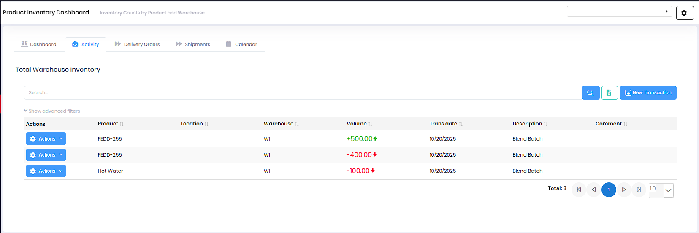
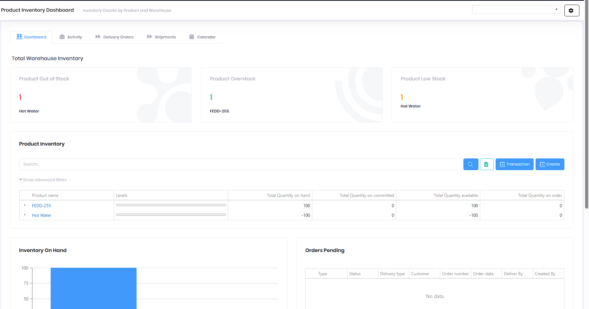

# Product Inventory

Product Inventory provides real-time visibility into product quantities across all warehouses, vehicles, and storage locations. This module tracks inventory levels, movements, and helps prevent stockouts with alerts and dashboards.

## Overview

The Product Inventory Dashboard provides comprehensive inventory visibility with multiple tabs for different views:

* **Dashboard** - Summary cards, inventory levels, and visual analytics
* **Activity** - Recent inventory transactions and movements
* **Delivery Orders** - Related delivery order information
* **Shipments** - Inbound and outbound shipment tracking
* **Calendar** - Schedule view of inventory activities

*Product Inventory Dashboard showing stock alerts, inventory levels, and charts*

## Dashboard Tab

The Dashboard tab provides a high-level overview of your inventory status:

### Stock Alert Cards

Three summary cards highlight critical inventory situations:

* **Product Out of Stock** - Products with zero or negative inventory (requires immediate attention)
* **Product Overstock** - Products exceeding maximum stock levels (may need redistribution)
* **Product Low Stock** - Products below minimum thresholds (reorder recommended)

Each card shows the count of affected products and lists specific product names.

### Product Inventory Table

The main inventory table displays:

* **Product name** - Expandable to view details
* **Levels** - Visual bar indicator showing current stock level relative to min/max
* **Total Quantity on hand** - Current available inventory
* **Total Quantity on committed** - Inventory allocated to orders
* **Total Quantity available** - On hand minus committed
* **Total Quantity on order** - Incoming inventory from purchase orders

Columns with negative values display in red to highlight inventory deficits.

### Visual Analytics

**Inventory On Hand Chart** - Bar chart showing total inventory quantities by product, providing quick visual comparison of stock levels across your product catalog.

**Orders Pending** - Table showing delivery orders awaiting fulfillment, including Type, Status, Delivery type, Customer, Order number, Order date, Deliver By, and Created By.

## Activity Tab

The Activity tab shows recent inventory transactions and movements across all warehouses.

*Activity tab showing inventory transactions with volume changes*

### Transaction History

Each transaction record displays:

* **Actions** - Menu for transaction operations
* **Product** - Product name
* **Location** - Customer location (if applicable)
* **Warehouse** - Warehouse where transaction occurred
* **Volume** - Quantity change with color coding:
  - Green (+) for inventory increases (receipts, blend production)
  - Red (-) for inventory decreases (consumption, deliveries)
* **Trans date** - Transaction date
* **Description** - Transaction type (e.g., "Blend Batch", "Shipment Receipt", "Delivery")
* **Comment** - Additional transaction details

### Transaction Types

Common inventory transactions include:

* **Blend Batch** - Inventory adjustments from product blending (components consumed, finished product added)
* **Shipment Receipt** - Inventory increases from received shipments
* **Delivery** - Inventory decreases from completed deliveries
* **Transfer** - Inventory movements between warehouses
* **Adjustment** - Manual inventory corrections

## Key Features

* View current inventory levels by product and warehouse
* Track inventory across multiple warehouses and vehicles
* Monitor inventory movements and transaction history
* Identify low stock, out of stock, and overstock situations
* View inventory history and complete audit trail
* Support for multiple units of measure
* Real-time inventory updates from field activities and production
* Visual inventory level indicators
* Generate and export inventory reports
* Filter and search across all inventory records

## Permissions

Access to Product Inventory features requires the following permissions:

| Display Name | Description |
|--------------|-------------|
| Product Inventory | View product inventory dashboard and levels |
| Create Product Inventory | Create inventory records |
| Edit Product Inventory | Modify inventory records |
| Delete Product Inventory | Remove inventory records |
| Product Inventory Transactions | View inventory transaction history |
| Create Product Inventory Transactions | Create manual inventory adjustments |
| Edit Product Inventory Transactions | Modify inventory transactions |
| Delete Product Inventory Transactions | Remove inventory transactions |

**Related Permissions:**

| Display Name | Description |
|--------------|-------------|
| [Products](Products.md) | View products (required to manage inventory) |
| [Warehouses](Warehouses.md) | View warehouse locations |
| [Shipments](Shipments.md) | View and receive shipments (updates inventory) |
| [Blend Batches](ProductBlendBatchs.md) | View blend batches (updates inventory) |
| [Delivery Orders](../Distribution/DeliveryOrders.md) | View delivery orders (consumes inventory) |

## Related Documentation

* [Products](Products.md) - Product catalog and specifications
* [Shipments](Shipments.md) - Inbound and outbound shipment tracking
* [Blend Batches](ProductBlendBatchs.md) - Blended product batch tracking
* [Warehouses](Warehouses.md) - Warehouse locations and management

