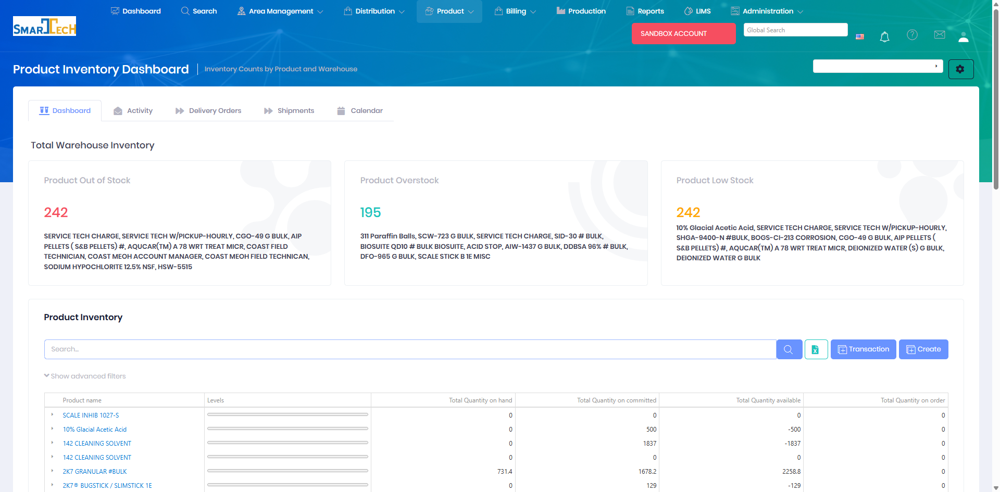
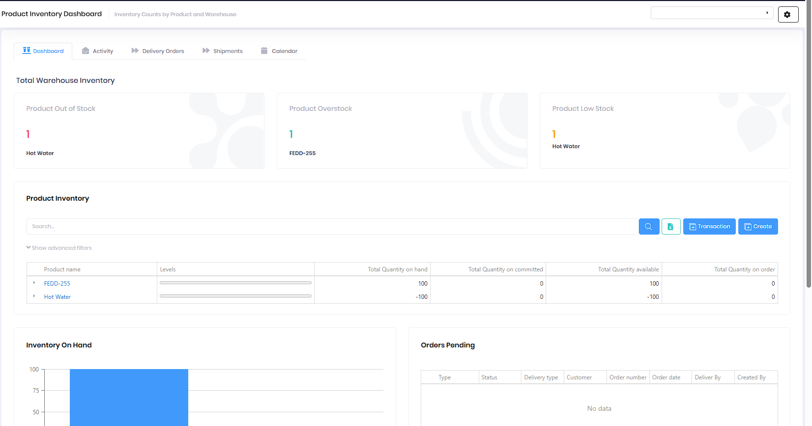

# Product Inventory

Product Inventory provides real-time visibility into product quantities across all warehouses, vehicles, and storage locations. This module tracks inventory levels, movements, and helps prevent stockouts with alerts and dashboards.

## Overview

The Product Inventory Dashboard provides comprehensive inventory visibility with multiple tabs for different views:

* **Dashboard** - Summary cards, inventory levels, and visual analytics
* **Activity** - Recent inventory transactions and movements
* **Delivery Orders** - Related delivery order information
* **Shipments** - Inbound and outbound shipment tracking
* **Calendar** - Schedule view of inventory activities
* **Forecasting** - Demand forecasting, risk analysis, and warehouse forecast (see [Inventory Forecasting](../Guides/Workflows/InventoryForecasting.md) workflow guide)

The Product Inventory Dashboard displays critical inventory metrics and detailed product-level information.

## Dashboard Tab

The Dashboard tab provides a high-level overview of your inventory status:

### Stock Alert Cards

Three summary cards highlight critical inventory situations:

* **Product Out of Stock** - Products with zero or negative inventory (requires immediate attention)
* **Product Overstock** - Products exceeding maximum stock levels (may need redistribution)
* **Product Low Stock** - Products below minimum thresholds (reorder recommended)

Each card shows the count of affected products and lists specific product names.

### Product Inventory Table

The main inventory table displays:

* **Product name** - Expandable to view details
* **Levels** - Visual bar indicator showing current stock level relative to min/max
* **Total Quantity on hand** - Current available inventory
* **Total Quantity on committed** - Inventory allocated to orders
* **Total Quantity available** - On hand minus committed
* **Total Quantity on order** - Incoming inventory from purchase orders

Columns with negative values display in red to highlight inventory deficits.

### Visual Analytics

**Inventory On Hand Chart** - Bar chart showing total inventory quantities by product, providing quick visual comparison of stock levels across your product catalog.

**Orders Pending** - Table showing delivery orders awaiting fulfillment, including Type, Status, Delivery type, Customer, Order number, Order date, Deliver By, and Created By.

## Activity Tab

The Activity tab shows recent inventory transactions and movements across all warehouses.

*Activity tab showing inventory transactions with volume changes*

### Transaction History

Each transaction record displays:

* **Actions** - Menu for transaction operations
* **Product** - Product name
* **Location** - Customer location (if applicable)
* **Warehouse** - Warehouse where transaction occurred
* **Volume** - Quantity change with color coding:
  - Green (+) for inventory increases (receipts, blend production)
  - Red (-) for inventory decreases (consumption, deliveries)
* **Trans date** - Transaction date
* **Description** - Transaction type (e.g., "Blend Batch", "Shipment Receipt", "Delivery")
* **Comment** - Additional transaction details

### Transaction Types

Common inventory transactions include:

* **Blend Batch** - Inventory adjustments from product blending (components consumed, finished product added)
* **Shipment Receipt** - Inventory increases from received shipments
* **Delivery** - Inventory decreases from completed deliveries
* **Transfer** - Inventory movements between warehouses
* **Adjustment** - Manual inventory corrections
* **Treatment Deduction** - Automatic warehouse inventory decrease when treatments are created (without a shipment/BOL). When a shipment is later created for the treatment, the system reverses this deduction to avoid double-counting. See [Treatments](../Distribution/Treatments.md) for details.

## Forecasting Tab

The Forecasting tab helps you anticipate demand, identify stockout risks, and plan reorders. It has two sub-tabs: **Risk Analysis** and **Warehouse Forecast**.

### Risk Analysis Sub-tab

The Risk Analysis view uses historical usage, treatment schedules, and delivery orders to predict demand and classify inventory risk.

**Summary Cards**

* **Critical Risk** - Count of products in critical condition (out of stock, stockout within 7 days, or unable to fulfill 7-day committed demand)
* **High Risk** - Count of products at high risk (stockout within 14 days, below reorder point, or insufficient for 30-day committed demand)
* **Stockout within 7 days** - Products expected to run out within a week
* **Need Reorder Now** - Products that should be reordered immediately

**Alert Summary Panel** - Shows active inventory alerts by severity.

**Forecast Grid** - Displays one row per product/warehouse with:

* **Product**, **Warehouse** - Product and warehouse
* **Risk Level** - Color-coded (Critical, High, Medium, Low)
* **Current Quantity Available** - Available inventory
* **Average Daily Usage** - Based on recent transaction history
* **Estimated Days Until Stockout** - When stock is expected to run out
* **Predicted Stockout Date** - Date of expected stockout
* **Forecasted Demand** - Projected demand for 7, 14, 30, 60, and 90 days
* **Scheduled Demand** - Demand from treatment schedules
* **Delivery Order Demand** - Demand from delivery orders
* **Total Committed Demand** - Combined committed demand
* **Pending Supply** - Incoming quantity from purchase orders
* **Recommended Reorder Quantity** - Suggested order quantity
* **Velocity Trend** - Percentage change in usage (7-day vs 30-day average); alerts when change exceeds 25%
* **Risk Reason** - Explanation for the assigned risk level

**Filters**

* **Forecast days** - 30, 60, or 90 days
* **Only At-Risk** - Show only products with elevated risk
* **Warehouse** - Filter by warehouse

**Master-Detail** - Expand a row to see detailed **Current State** (On Hand, Available, Reorder Point, Preferred Level), **Usage Analysis** (7-day and 30-day averages, variance, velocity trend), **Forecasted Demand** by period, and **Committed Demand** breakdown (Treatment Schedule and Delivery Orders).

**Reorder Alerts** - Section listing products that need immediate reorder with recommended quantities.

**Export** - Export the risk analysis grid to Excel.

### Warehouse Forecast Sub-tab

The Warehouse Forecast view compares delivery order demand to current inventory by warehouse and date.

**Date Range Filters** - **Start Date** (default: one month back) and **End Date** (optional) to scope the forecast window.

**Grid Columns**

* **Warehouse**, **Product** - Warehouse and product
* **Delivery Date** - Date quantity is needed
* **Quantity Needed** - Sum of delivery order quantities due on that date
* **Quantity On Hand** - Current on-hand quantity
* **Quantity Available** - Available after commitments
* **Difference** - On Hand minus Needed (color-coded; negative indicates shortfall)
* **On Order** - Quantity on purchase orders
* **Committed** - Quantity already committed

**Product Totals Summary** - Aggregated totals by product across the date range.

**Export** - Export the warehouse forecast to Excel.

### Risk Level Criteria

| Risk Level | Criteria |
|------------|----------|
| **Critical** | Out of stock, stockout within 7 days, or cannot fulfill 7-day committed demand |
| **High** | Stockout within 14 days, below reorder point, or insufficient for 30-day committed demand |
| **Medium** | Stockout within 30 days, or velocity increasing more than 25% |
| **Low** | Adequate stock levels |

## Key Features

* View current inventory levels by product and warehouse
* Track inventory across multiple warehouses and vehicles
* Monitor inventory movements and transaction history
* Identify low stock, out of stock, and overstock situations
* View inventory history and complete audit trail
* Support for multiple units of measure
* Real-time inventory updates from field activities and production (including automatic deduction when treatments are created)
* Visual inventory level indicators
* Generate and export inventory reports
* Filter and search across all inventory records
* **Forecasting** - Demand forecasting and stockout prediction with risk analysis (Critical/High/Medium/Low)
* **Reorder recommendations** - Recommended reorder quantities and reorder alerts based on usage and committed demand
* **Warehouse forecast** - Compare delivery order demand to current inventory by warehouse and date; export to Excel

## Permissions

Access to Product Inventory features requires the following permissions:

| Display Name | Description |
|--------------|-------------|
| Product Inventory | View product inventory dashboard and levels |
| Create Product Inventory | Create inventory records |
| Edit Product Inventory | Modify inventory records |
| Delete Product Inventory | Remove inventory records |
| Product Inventory Transactions | View inventory transaction history |
| Create Product Inventory Transactions | Create manual inventory adjustments |
| Edit Product Inventory Transactions | Modify inventory transactions |
| Delete Product Inventory Transactions | Remove inventory transactions |

Forecasting tab features (Risk Analysis and Warehouse Forecast) use the same Product Inventory permissions.

**Related Permissions:**

| Display Name | Description |
|--------------|-------------|
| [Products](Products.md) | View products (required to manage inventory) |
| [Warehouses](Warehouses.md) | View warehouse locations |
| [Shipments](Shipments.md) | View and receive shipments (updates inventory) |
| [Blend Batches](ProductBlendBatchs.md) | View blend batches (updates inventory) |
| [Delivery Orders](../Distribution/DeliveryOrders.md) | View delivery orders (consumes inventory) |

## Related Documentation

* [Products](Products.md) - Product catalog and specifications
* [Shipments](Shipments.md) - Inbound and outbound shipment tracking
* [Blend Batches](ProductBlendBatchs.md) - Blended product batch tracking
* [Warehouses](Warehouses.md) - Warehouse locations and management
* [Inventory Forecasting](../Guides/Workflows/InventoryForecasting.md) - Workflow guide for the Forecasting tab
* [Treatments](../Distribution/Treatments.md) - Treatment records (automatically deduct warehouse inventory when created)

