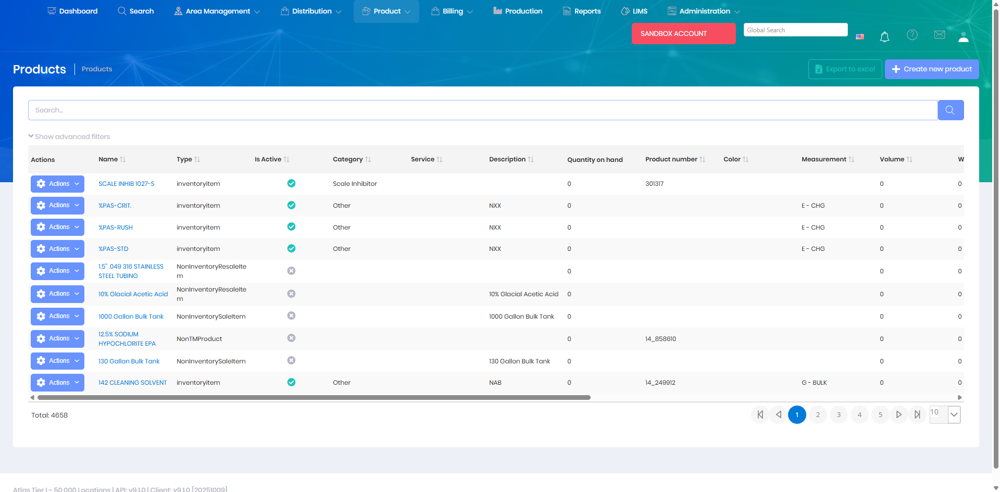
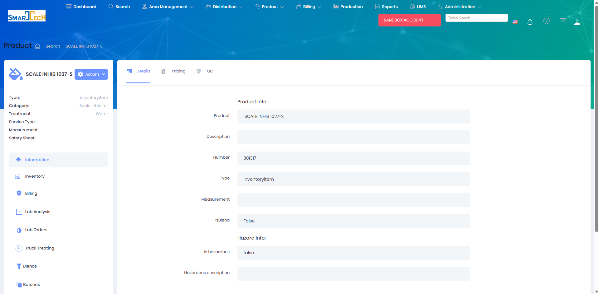
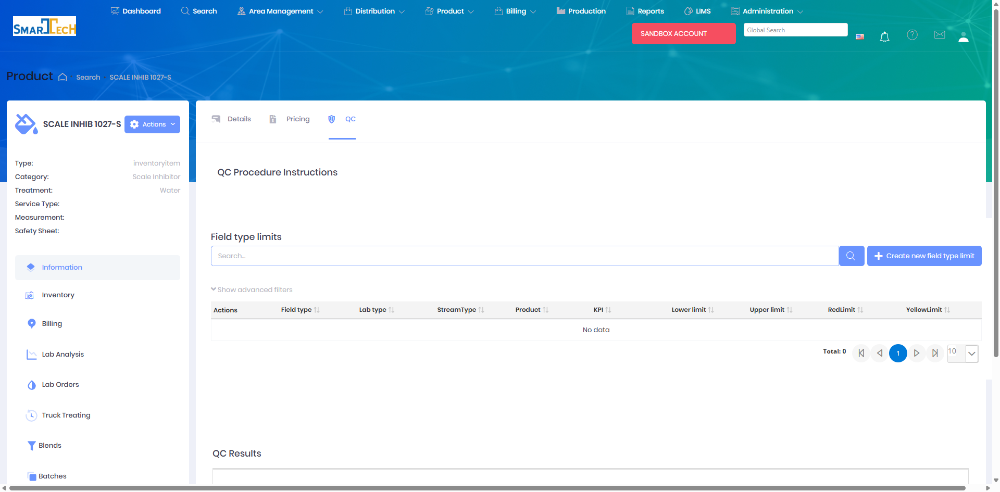

# Products

Products define the catalog of chemicals, equipment, services, and other items that can be sold, delivered, or tracked in Atlas. The Products module maintains product specifications, classifications, and base pricing information.

## Overview

The Products page displays your complete product catalog. Each product includes detailed specifications, inventory settings, pricing information, and classifications that control how the product is managed throughout the system.

The Products page displays a searchable grid with product information including Name, Type, Category, Service, Description, Quantity on hand, Product number, Color, Measurement, Volume, Weight, and hazard information.

## Product Detail View

Click on any product name to view detailed product information:

The Product Detail view provides access to comprehensive product information through multiple tabs:
* **Details** - Basic product information, product number, type, measurement, and hazard details
* **Pricing** - Customer-specific pricing rules and base pricing
* **QC** - Quality control limits and test results

### Quality Control (QC) Tab

The QC tab manages quality testing requirements and limits for the product:

The QC tab includes:

**Field type limits** - Define acceptable test value ranges:
* **Field type** - The specific test or measurement (e.g., pH, viscosity, specific gravity)
* **Lab type** - Type of lab analysis required
* **StreamType** - Product stream classification (oil, water, gas)
* **Product** - Associated product
* **KPI** - Key Performance Indicator designation
* **Lower limit** - Minimum acceptable value
* **Upper limit** - Maximum acceptable value
* **RedLimit** - Critical threshold requiring immediate action
* **YellowLimit** - Warning threshold for attention

**QC Results** - Displays historical QC test results for this product, showing pass/fail status and specific test values against the defined limits.

These QC limits tie directly to [Lab QC Requests](LabQCRequests.md), where test results are compared against these thresholds to determine if a product batch passes or fails quality control testing.

## Key Features

* Create and manage product records
* Define product specifications and descriptions
* Set product categories and types
* Configure inventory tracking settings
* Establish base pricing
* Manage product units of measure
* Link products to blend formulations
* Set product-specific billing rules
* Track product active/inactive status

## Permissions

Access to Products features requires the following permissions:

| Display Name | Description |
|--------------|-------------|
| Products | View product catalog |
| Create Products | Create new products |
| Edit Products | Modify existing products |
| Delete Products | Remove products from catalog |

**Related Permissions:**

| Display Name | Description |
|--------------|-------------|
| Product Categories | View/manage product categories |
| Product Types | View/manage product types |
| [Product Blends](../Blends/Index.md) | View product blend formulations |
| [Price Schedules](PriceSchedules.md) | View/manage customer-specific pricing |
| [Product Inventory](ProductInventory.md) | View product inventory levels |

## Related Documentation

* [Product Inventory](ProductInventory.md) - Inventory tracking
* [Product Blends Management](../Blends/Index.md) - Blend formulations
* [Price Schedules](PriceSchedules.md) - Customer pricing

