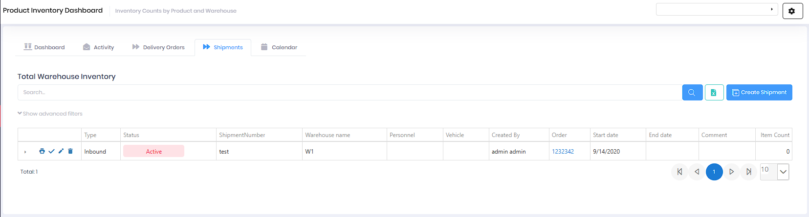

# Shipments

Shipments track the receipt of products from vendors and the movement of inventory between warehouses. This module ensures accurate inventory tracking and provides visibility into inbound and outbound logistics.

## Overview

The Shipments page manages all inbound receipts and outbound shipments of products. Shipments can be linked to purchase orders for receiving or used to document transfers and outbound movements. Shipments are also accessible from the Product Inventory Dashboard via the Shipments tab.

*Shipments tab showing active inbound shipment with warehouse and order details*

## Shipment Management

### Viewing Shipments

Access shipments from:
* Main menu → Product → Shipments
* Product Inventory Dashboard → Shipments tab

The shipments grid displays:

* **Type** - Inbound (receiving) or Outbound (shipping out)
* **Status** - Active (red badge), Completed (green badge), or other status indicators
* **ShipmentNumber** - Unique identifier for tracking
* **Warehouse name** - Destination (inbound) or source (outbound) warehouse
* **Personnel** - Assigned staff member (if applicable)
* **Vehicle** - Assigned vehicle for transport (if applicable)
* **Created By** - User who created the shipment record
* **Order** - Linked purchase order or sales order number
* **Start date** - Expected arrival or shipment date
* **End date** - Completion date
* **Comment** - Additional notes or instructions
* **Item Count** - Number of line items in the shipment

### Creating a New Shipment

1. Click **Create Shipment** button
2. Select **Type** (Inbound or Outbound)
3. Enter **ShipmentNumber** (or use auto-generated number)
4. Select **Warehouse** (receiving or shipping location)
5. Link to **Order** (purchase order or sales order)
6. Set **Start date** (expected arrival/shipment date)
7. Optionally assign **Personnel** and **Vehicle**
8. Add **Comment** with special instructions
9. Click **Save**

### Managing Shipment Items

After creating a shipment, add the specific products being shipped:

1. Open the shipment record
2. Click **Add Item** or similar button
3. Select **Product** from catalog
4. Enter **Quantity** being shipped/received
5. Select **Unit of Measure**
6. Add line item notes if needed
7. Repeat for all products in shipment

### Receiving a Shipment

For inbound shipments, the receiving process updates inventory:

1. Open the shipment record (Status: Active)
2. Verify products and quantities match what was received
3. Adjust quantities if there are discrepancies
4. Click **Receive** or **Complete Shipment**
5. Status changes to "Completed"
6. Inventory is automatically updated in the destination warehouse

### Shipment Status

* **Active** - Shipment created, awaiting receipt or completion
* **Completed** - Shipment received and inventory updated
* **Cancelled** - Shipment voided (no inventory impact)

## Key Features

* Create and track inbound and outbound shipment records
* Link shipments to purchase orders for receiving
* Record received products and quantities
* Automatic inventory updates upon shipment completion
* Track shipment containers and packaging details
* Manage bill of lading and carrier information
* Record shipment dates and expected arrival
* Support partial receipts and back-orders
* Assign personnel and vehicles to shipments
* View complete shipment history and audit trail
* Generate receiving documentation and reports
* Filter and search shipments by status, warehouse, date, or order
* Export shipment data to Excel

## Permissions

Access to Shipments features requires the following permissions:

| Display Name | Description |
|--------------|-------------|
| Shipments | View shipment records |
| Create Shipments | Create new inbound/outbound shipments |
| Edit Shipments | Modify shipment details |
| Delete Shipments | Remove shipment records |
| Shipment Items | View shipment line items |
| Create Shipment Items | Add products to shipments |
| Edit Shipment Items | Modify shipment line items |
| Delete Shipment Items | Remove products from shipments |

**Related Permissions:**

| Display Name | Description |
|--------------|-------------|
| [Purchase Orders](PurchaseOrders.md) | View/link purchase orders to inbound shipments |
| [Products](Products.md) | View products (required for shipment items) |
| [Warehouses](Warehouses.md) | View warehouse locations |
| [Product Inventory](ProductInventory.md) | View inventory (automatically updated on shipment receipt) |
| Shipment Types | View shipment types |
| Shipment Containers | View container types |

## Related Documentation

* [Product Inventory](ProductInventory.md) - View inventory levels and transaction history
* [Purchase Orders](PurchaseOrders.md) - Create purchase orders to generate inbound shipments
* [Warehouses](Warehouses.md) - Manage warehouse locations for shipments

