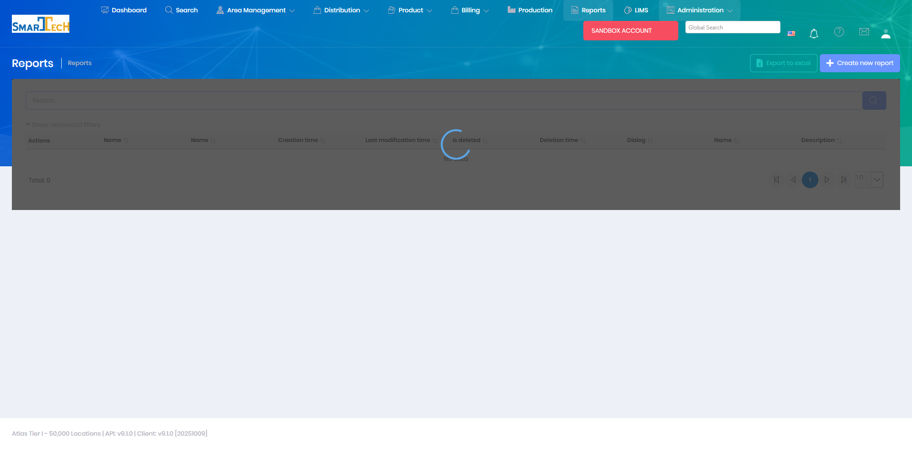

# Reports

Reports provides a library of pre-built and custom reports for analyzing operations, production, treatments, billing, and other business data. This module enables data-driven decision making across all areas of the business.

## Overview

The Reports module offers comprehensive reporting capabilities covering all aspects of Atlas operations. Reports can be filtered, scheduled, exported, and customized to meet specific business needs.

The Reports page provides access to the report catalog where users can create custom reports, manage report definitions, and configure report parameters. The interface includes options to export reports to Excel and create new custom report definitions.

## Key Features

* Browse report catalog by category
* Filter and parameterize reports
* Schedule automatic report generation
* Export reports to PDF, Excel, or CSV
* Email reports to distribution lists
* Create custom reports using report builder
* Save report favorites and presets
* View report history
* Dashboard integration for key metrics

## Report Categories

* **Production Reports** - Well production, trends, and performance
* **Treatment Reports** - Treatment history, products used, effectiveness
* **Billing Reports** - Invoices, revenue, accounts receivable
* **Inventory Reports** - Stock levels, usage, replenishment
* **Operations Reports** - Field activities, route performance, exceptions
* **Lab Reports** - Test results, trends, compliance
* **Customer Reports** - Customer-specific operations and billing
* **Management Reports** - KPIs, dashboards, executive summaries

## Report Formats

* **Tabular** - Grid-based data tables
* **Charts** - Graphs and visualizations
* **Dashboard** - Multi-metric displays
* **Custom** - User-defined layouts

## Scheduling Reports

Reports can be scheduled to run automatically:
* Daily, weekly, monthly, or custom frequencies
* Automatic email delivery
* Saved to document repository
* Alert notifications on specific conditions

## Permissions

Access to Reports features requires the following permissions:

| Display Name | Description |
|--------------|-------------|
| Reports | View and run reports |
| Report Builder | Create and edit custom reports |
| Schedule Reports | Schedule automatic report generation |
| Report Types | Manage report type classifications |
| Report Time Periods | Manage report time period definitions |
| Report Categories | Manage report category groupings |

**Related Permissions:**

| Display Name | Description |
|--------------|-------------|
| [Treatments](../Distribution/Treatments.md) | Access treatment data in reports |
| [Delivery Orders](../Distribution/DeliveryOrders.md) | Access delivery data in reports |
| [Invoices](../Billing/Invoices.md) | Access billing data in reports |
| [Locations](../AreaManagement/Locations.md) | Access location data in reports |
| [Products](../Product/Products.md) | Access product data in reports |
| [Lab Orders](../LIMS/Create-Lab-Order.md) | Access lab data in reports |

## Related Documentation

* [Dashboard](../Dashboard/Index.md) - Dashboard widgets and visualizations

