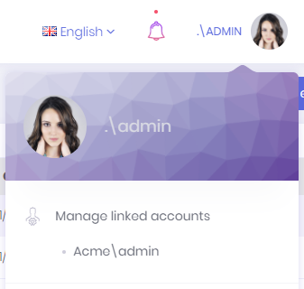
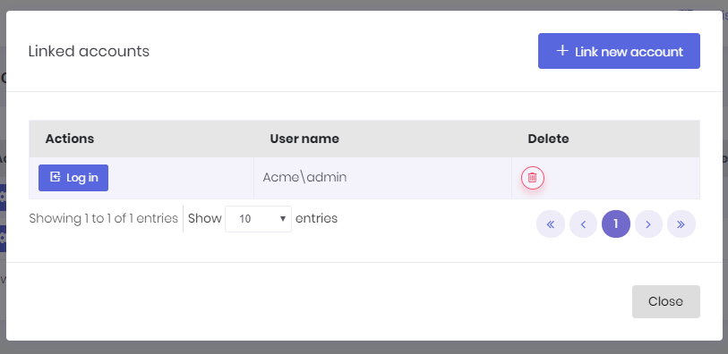
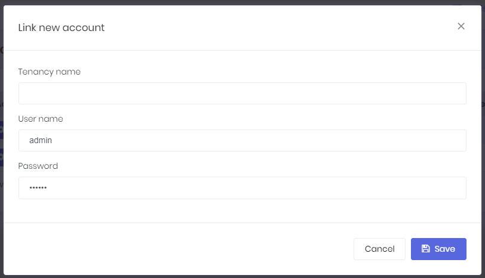
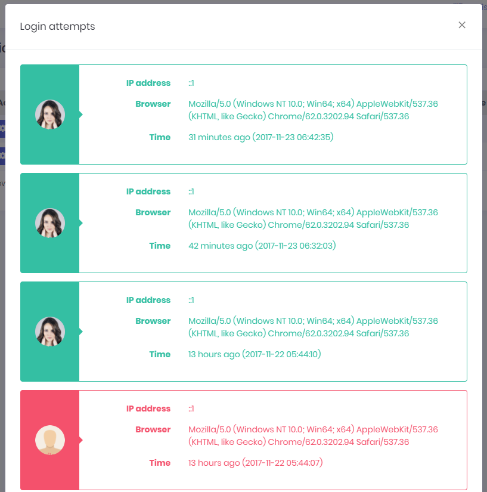
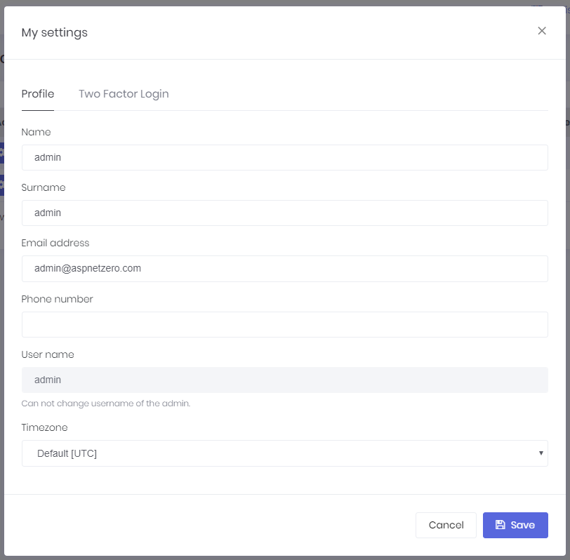
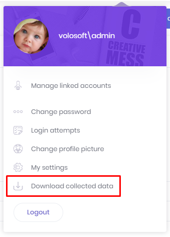

# User Settings

# User Menu

A user can click his name at top right corner to open user menu:

## Linked Accounts

Linked accounts are used to link multiple accounts to each other. In this way, a user can easily navigate through his accounts using this feature.

User can link new accounts or delete already linked accounts by clicking the **Manage accounts** link.

In order to link a new account, user must enter login credentials of related account.

## Change Password

User can change the password using this option. **ProfileAppService** is used to change password.

## Login Attempts

All login attempts (succeed of failed) are logged in the application. A user can see last login attempts for his/her account.

## Change Picture

A user can change his/her own profile picture. Currently JPG, JPEG, GIF and PNG files are supported.

A user can also use Gravatar image for profile picture using change profile picture modal window.

## My Settings

My settings modal is used to change user profile settings:

As shown here, **admin** user name can not be changed. It's considered a special user name since it's used in database migration seed. Other users can change their usernames.

Users can also validate phone number on this page. If phone number validation is enabled, a "**Confirm**" button will be visible when user enters a phone number into the phone number textbox. When the confirm button is clicked, a confirmation code will be sent to user's phone number (if sms sending is implemented. You can use [Twilio](Features-Angular-Two-Factor-Authentication#twilio-integration) which is already integrated into Atlas) and entering that code into the opened dialog will confirm user's phone number.

## Download Collected Data

A user can download his/her collected data using this menu item.

Atlas compress those files into a new zip file and sends it to user as a notification so user can download his/her data.

## Logout

When the user clicks to **Logout** button, user's token is invalidated on the server side and removed from client side and the user is redirected to login page.

