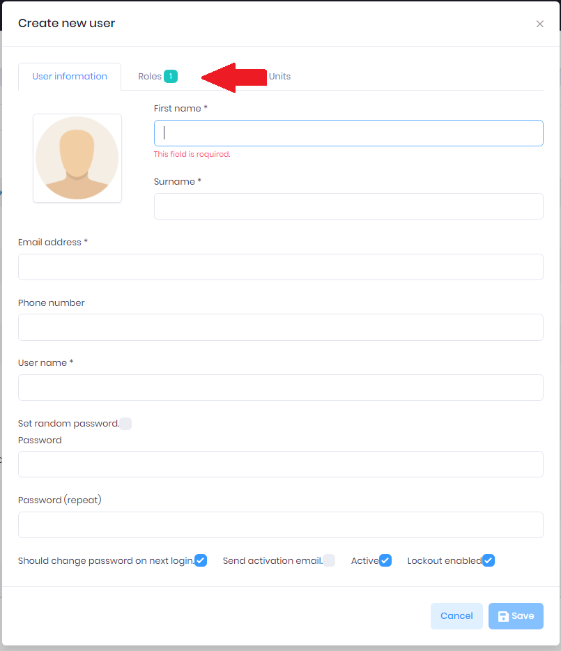

# User Management

> This document is aimed to intoduce and explain the steps to manage users and their access to Atlas. These actions are only possible if you are a manager with access to the admin permissions.

##### Creating an User
- To create a new user use the side navigation bar and select administration -> System -> Users
- Once in the Users page you will see a list of current users within the system select Create new user to open the create user modal.

- You will have to fill out the information for a new user enter in a default password for a new user like Password1234.
- Next switch to the Roles tab to display current roles setup for each of the employees

- Here you will see a list of roles for the user. Select which apply and click save.

- Once you select save a pop up will ask if you want to create a personnel for the new user select Yes for all user creations.

- Once you select yes a new modal will show you the personnel creation page with all of the users data. Fill out the Personnel type, manager, and title and select Save

- Next you can refer to the [getting started](../../Tutorials/getting-started.md) page for the new users to get them logged into the system and change their password.

##### Editing a User
- To Edit a user click on the actions drop down beside a user and select edit.
- From here you can change passwords alter any of the intially setup account and allow users back into their account.
- If you change someones password select Should change password on next login.

##### Deleting a User
- To delete a user click on the actions drop down beside a user and select delete.
