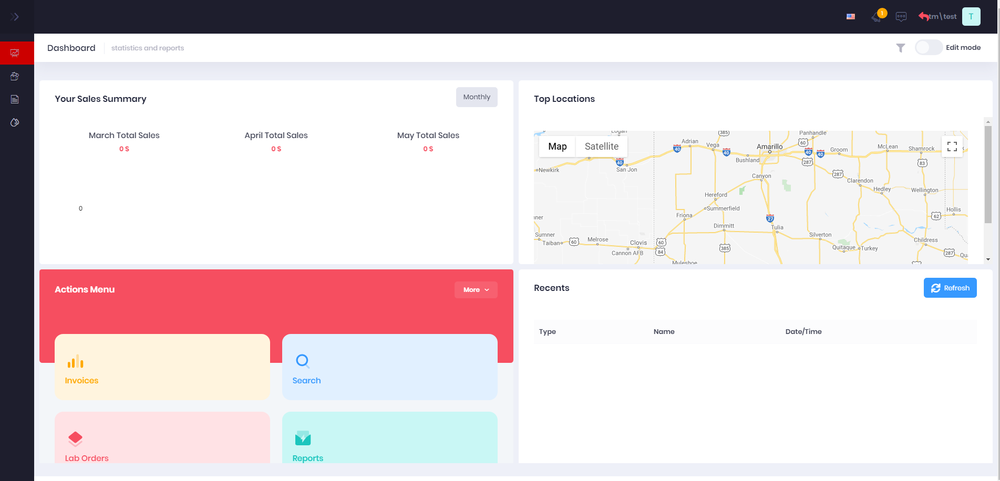

# Dashboard Customization

> If you dont see the dashboard upon login, talk with your manager to get assigned the correct role within Atlas.

Upon login you will arrive at this screen.

To start configuring your dashboard to your preferences you will need to toggle the edit switch in the top right corner.

This will bring up a menu at the bottom of your screen to add widgets and pages.

##### Adding a widget
- Select **Add Widget**
- This will show a modal with a drop down of all available widgets. (You can only have one of each widget at a time)
- Once you select the widget you want to add click **save** and the widget will be shown in your grid now

##### Moving widgets
- The dashboard is completely modular so you can configure the layout however you want to see it.
- Assuming you are still in edit mode you will be able to drag any widget to a desired location
- Once you get the dashboard how you want it to look click **save**

##### Removing widgets
- To remove a widget from your dashboard enable edit mode and click the X on the widget itself
- If you have accidently removed a widget refer back to Adding a widget

> If you ever get to a point where you want to start from scratch on the dashboard select **Back To Default** and you will be back to the presetup dashboard

 ## Next Step

* [Navigating Atlas](/navigation.md)