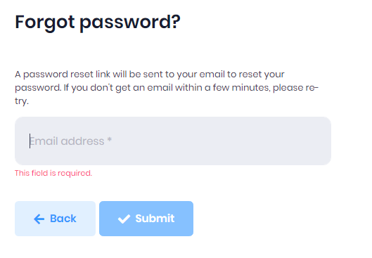

# Forgot Password
If a user forgets the password, it can be retrieved by clicking the **Forgot Password** link. On the forgot password screen, user enters the email address and password reset email will be sent to entered email address.

After receiving the email, user can click to Reset button in the email and user will be redirected to password reset page. In this page, user can change the existing password.

