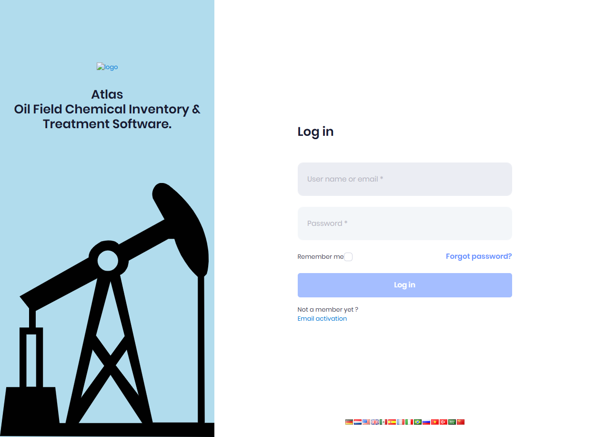
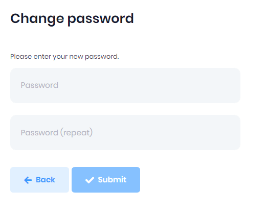

# Login

Default url for login is https://[CompanyName].sourcelogicatlas.com/account/login

The Atlas login page provides access to the system with the following elements:
* **Email address field** - Enter your company email address
* **Password field** - Enter your password (with show/hide toggle)
* **Remember me checkbox** - Keep you logged in across sessions
* **Forgot your password?** link - Reset password if needed
* **Log in button** - Submit credentials to access the system

Use your **Company** email and password for login. 

###### If you do not have an account please contact your manager to get your account created .

Also if this is your first time to login you will have to change your password on first login and will see the change password screen.

After the login, you are redirected to your dashboard.

### User Lockout
 Users are locked out for specified duration if they enter wrong password for a specified amount of times.

 ## Next Step

* [Dashboard Customization](../dashboard/customizing.md)